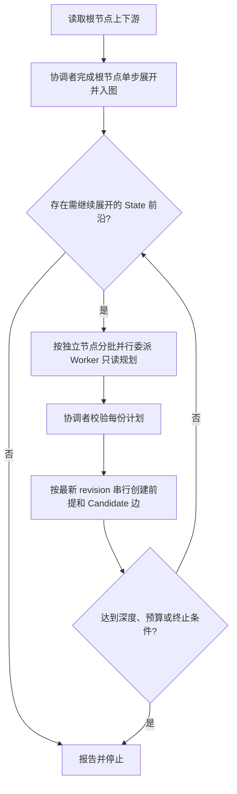

# InferenceGraph Parallel Backward Expansion

仅在用户显式调用 `/skill:inference-graph-parallel-backward-expansion` 时执行本技能。

本技能用于受控地递归反向展开已有 InferenceGraph 节点。它先由当前会话完成根节点的一次单步展开；根节点成功入图后，使用全局 `subagent` 工具让多个 Worker 同时规划彼此独立的前沿 `State` 节点。协调者随后逐份校验 Worker 结果，并使用最新 `graphRevision` 串行创建顶点和候选边。

并行的是节点级读取、推理与前提规划，不能并行写入同一个图。InferenceGraph 的 revision 契约要求每一次写入都以刚返回的 revision 为基准；协调者串行入图可避免冲突、重复结构和错误的 AND/OR 公式语义。

本技能不会修改或调用 `inference-graph-backward-expansion`；两者可并存使用。

## 输入与预检

从用户调用中获取以下信息；缺少必要限制时先询问，不要建立无界递归图：

- `sessionId`：InferenceGraph 会话 ID。
- `vertexId`：根节点 ID 或会话内 `Vn` 引用。
- `agentId`：协调者用于所有图写入的稳定 Agent ID。
- `maxDepth`：根节点下方最多继续展开的层数，必须为正整数。
- 至少一项预算或停止条件：`maxNodes`、`maxEdges`、明确的语义终止条件，或三者组合。
- `maxParallel`：每个波次最多提交的 Worker 数，范围 `1` 到 `8`，默认 `4`。全局 subagent 扩展最多提交 8 个任务，实际最多同时运行 4 个。
- 可选 `model`：若用户明确指定 `provider/model`，传给每一个 Worker；未指定时不要凭空构造模型参数。

典型调用：

```text
/skill:inference-graph-parallel-backward-expansion sessionId=<sessionId> vertexId=V7 agentId=<stable-agent-id> maxDepth=3 maxNodes=24 maxEdges=36 maxParallel=4
```

开始前确认：

1. 根节点已存在，且当前会话仍允许新增候选结构。
2. 全局 `subagent` 工具可用，用户级 `worker` Agent 可被发现，调用时使用 `agentScope: "user"`。
3. `inference_graph_get_reasoning_session`、`inference_graph_get_context_for_vertex`、`inference_graph_get_downstream_context_for_vertex`、`inference_graph_add_state_vertex`、`inference_graph_add_evidence_vertex` 与 `inference_graph_propose_inference_edge` 可用；工具缺失时先搜索或描述 MCP 工具，不要猜测参数。
4. 当前会话的边预算足以容纳本轮计划；不足时停止并报告，不自动提高预算。

## 不可违反的约束

1. 图中的持久化边始终是 `前提 -> 当前节点`。反向展开只用于规划，不能将边方向写反。
2. 一个公式调用中的多个来源是 AND；多个 `propose_inference_edge` 调用是 OR。不得把一个 AND 公式拆为多个单来源调用。
3. `Evidence` 仅表示可追溯的直接材料；仍需推导的命题必须是 `State`。
4. 下游路径、`reachable=true`、目标节点身份或后续 Goal 的存在性都不是当前节点成立的证据。
5. Worker 只能读取图并生成结构化前提计划，禁止调用任何会写图或改变边状态的工具，包括新增/更新顶点、提出/更新/claim/complete/release/block 推理边、完成或结束会话。
6. 只有协调者可写图。每次成功写入后必须保存返回的 `graphRevision`；下一次写入只能使用这个最新 revision。
7. 遇到 `RevisionConflict` 时，停止使用旧 revision，重新读取 session 和当前目标上下文，去重后才可重试该目标。
8. Worker 不得递归调用 `subagent`。并发由协调者按波次调度，避免指数级扩张。
9. 本技能只创建或复用 `Candidate` 结构；除非用户另行明确授权执行阶段，否则不 claim、取证、complete、release、block 或 finish。
10. 使用 `(sessionId, vertexId)` 作为已访问键。同一节点在同一调用中最多规划一次。

## 总体流程



## 阶段一：根节点单步展开并入图

根节点 `G` 必须由协调者先完成一次单步展开，不能跳过此阶段直接并发：

1. 调用 `inference_graph_get_reasoning_session(sessionId)`，取得当前 `graphRevision`、会话预算和状态。
2. 调用 `inference_graph_get_context_for_vertex(sessionId, G)`，阅读已有上游依赖、公式、证据摘要及可能的语义等价顶点。
3. 调用 `inference_graph_get_downstream_context_for_vertex(sessionId, G)`，仅用于理解 `G` 的用途，不得将其视作 `G` 的证据。
4. 在内存中规划 `G` 的直接前提公式。每个公式标明前提的 `kind`、标签、payload、dedupeKey、AND/OR 关系和必要的 evidence questions。
5. 对每个尚不存在的直接前提，串行调用 `inference_graph_add_evidence_vertex` 或 `inference_graph_add_state_vertex`。每次调用后保存返回的顶点 ID 与最新 `graphRevision`；语义等价顶点必须复用。
6. 对每个公式，串行调用一次 `inference_graph_propose_inference_edge`，使用该公式的全部来源顶点和目标 `G`。每次调用后更新 revision。
7. 记录根节点本轮实际创建或复用的 `State` 前提。它们是第一批候选前沿，但还不能自动全部调度。

根节点单步展开必须成功持久化后，才能进入并行阶段。若根节点没有需要继续推导的 `State` 前提，报告单步结果并停止。

## 阶段二：构建可并行前沿

每个波次开始时，协调者根据上一波次已提交的实际图结构构建前沿。仅调度同时满足以下条件的节点：

- 顶点是 `State`，不是 `Evidence`；
- 不属于用户明确认可的基础状态；
- 未超过 `maxDepth`，未超过节点或边预算；
- 不在已访问集合中；
- 读取其当前上下文后，仍缺少可完整支持它的已完成公式；
- 与本波次其他任务的目标顶点 ID 不重复。

先读取候选节点的当前上下文，再按稳定顺序排序，例如深度升序、规范化 `vertexId` 升序。将前沿切成每批最多 `maxParallel` 个任务；同一批任务可以共享只读 session，但不能共享一个目标顶点。

若某候选节点在刷新上下文后已被其他操作支持、成为基础状态、被阻断或不再满足预算，跳过它并记录原因。

## 阶段三：并行 Worker 规划

对每个波次使用一次 `subagent` 的 `tasks` 模式。必须使用全局 Agent scope：

```json
{
  "tasks": [
    {
      "agent": "worker",
      "cwd": "<当前工作目录>",
      "task": "<为一个已分配 vertexId 生成只读反向展开计划的完整任务>"
    }
  ],
  "agentScope": "user"
}
```

仅当用户已明确提供 `provider/model` 时，才在顶层额外传入：

```json
{
  "model": "<用户确认的 provider/model>"
}
```

每个 Worker 任务必须包含以下不可省略的边界：

```text
任务身份：InferenceGraph 只读前提规划 Worker
角色规则：先遵守当前工作目录已加载的 AGENTS/系统约束；如该项目要求从角色目录选择角色，先读取目录并声明兼容的正式角色。本任务身份不替代该项目的正式角色。
分配目标：sessionId=<sessionId>，vertexId=<assignedVertexId>
允许操作：读取 reasoning session、该顶点上下游上下文和必要的既有顶点信息。
禁止操作：任何 InferenceGraph 写入、任何边状态转换、创建/编辑文件、调用 subagent、执行外部副作用。
目标：仅规划 assignedVertexId 的直接前提公式，不递归展开前提。

先读取当前 session、vertex 上游 context 和 downstream context。下游只解释用途，不能作为证据。
返回严格 JSON，不要写图：
{
  "targetVertexId": "<canonical id>",
  "status": "ready | already-supported | terminal | blocked | insufficient-context",
  "formulae": [
    {
      "label": "<direct-premise formula label>",
      "premises": [
        {
          "kind": "Evidence | State",
          "label": "<precise direct premise>",
          "payload": {},
          "dedupeKey": "<stable semantic key when applicable>",
          "whyDirect": "<why this directly supports the assigned target>"
        }
      ],
      "evidenceQuestions": [
        { "prompt": "<optional validation question applicable to every edge in this formula>" }
      ]
    }
  ],
  "risks": ["<ambiguity, conflict, or missing context>"],
  "stopReason": "<when status is not ready>"
}

同一 formula 的 premises 是 AND；formulae 数组中的不同元素是 OR。不要把下游结论当作前提，不要给出间接前提捷径。
```

Worker 失败、超时、返回非 JSON 或违反只读边界时，协调者不得猜测其计划或让其他 Worker 覆盖同一任务；将该节点保留在剩余前沿并记录失败原因。

## 阶段四：协调者串行校验与入图

等待整批 Worker 结束后，协调者按前沿的稳定顺序处理每一份 `status=ready` 的计划。不要在 Worker 尚运行时开始写图。

对每个目标依次执行：

1. 再次读取 `inference_graph_get_reasoning_session` 和 `inference_graph_get_context_for_vertex`，取得最新 revision 并确认目标仍需展开。
2. 校验返回公式只含直接前提，`Evidence`/`State` 分类合理，AND/OR 关系正确，不与已有完整公式重复，也没有循环依赖或超出用户范围的命题。
3. 串行创建或复用该目标的每个直接前提。每次 `add_state_vertex` 或 `add_evidence_vertex` 成功后都使用响应中的最新 `graphRevision`。
4. 每个 AND 公式只调用一次 `inference_graph_propose_inference_edge`，将全部来源顶点写入 `sourceVertexIds`，目标写入 `targetVertexIds`。不同 OR 公式分别调用。
5. 只有同一问题适用于公式的每条物理边时才将其放在 `evidenceQuestions`；否则先不写，由后续独立阶段处理。
6. 从实际创建或复用的直接 `State` 前提中收集下一波次候选节点；不要使用 Worker 预测的 ID 代替服务端返回的 ID。

若发生 `RevisionConflict`，重新读取 session 与目标 context，检查等价顶点/公式是否已经出现，再从当前 revision 重试尚未提交的最小操作。冲突持续、预算耗尽或语义已变更时停止处理该目标，并把它放回剩余前沿。

## 波次循环与停止条件

根节点单步完成后，按“并行 Worker 规划 -> 协调者串行入图 -> 生成下一前沿”循环。每轮完成后增加深度计数，并在下一轮前重新检查：

- 是否达到 `maxDepth`、`maxNodes`、`maxEdges` 或用户指定的语义终止条件；
- 是否仍存在符合条件的独立 `State` 前沿；
- 是否发生用户中止、会话关闭、预算不足或无法恢复的 MCP/subagent 错误；
- 是否所有候选分支均已落到 `Evidence` 或用户认可的基础状态。

任一停止条件满足时，不再启动新的 Worker。已经完成的当前批次要如实报告；未提交的计划不可当作图中存在的结构。

## 输出报告

完成时按以下结构报告：

```text
## 并行反向展开结果

### 输入与范围
- sessionId：...
- 根节点：...
- maxDepth / maxNodes / maxEdges / maxParallel：...
- 使用模型：<用户指定或未指定>

### 根节点单步展开
- 创建/复用的顶点：...
- 新建公式与 Candidate 边：...
- root 完成后的 graphRevision：...

### 并行波次
- 深度 <n>：调度节点数、实际并发批次、成功/跳过/失败数量。
- 每个目标：Worker 结论、协调者是否提交、公式语义、创建/复用顶点、formulaId、物理边和提交后的 revision。

### 停止与剩余前沿
- 停止条件：...
- 未展开节点及原因：...
- RevisionConflict、去重、预算限制、Worker 失败或语义不确定项：...

### 约束确认
- 已仅并行读取和规划，所有图写入由协调者按最新 revision 串行执行。
- 未 claim、取证、complete、release、block 或 finish 任何边/会话，除非用户另行授权。
```

不要把 Candidate 结构、下游可达性、Worker 的未提交计划或未完成公式描述为已经证明的结论。
