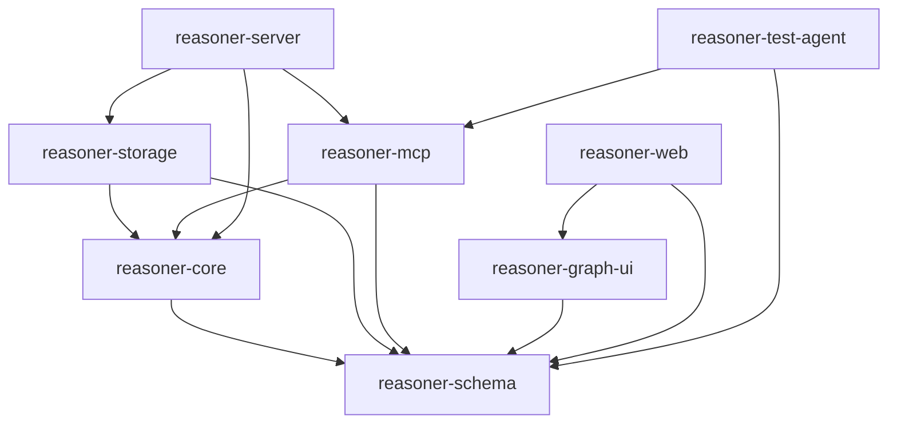

# 证据图 Reasoner Core TypeScript 全栈实施方案

本文档用于指导 `$ai-plan-executor` 在 `InferenceGraph` 仓库中创建一个可运行的 TypeScript 全栈 Reasoner Core MVP。执行范围包含图内核、MCP、SQLite、上下文投影、DFS/BFS、并行边租约、内置 Web UI 和离线案例回放；本文档只制定源码实施计划，不在当前阶段执行实现。

> **版本说明**：本文档由 BionanoSemi 仓库的原始方案改造而来。原方案依赖的 `Doc/Architecture/evidence-graph-local-reasoning.md` 在本仓库不存在，因此**本文档自身即唯一事实来源**：MCP 工具清单、图模型、契约和验收标准以本文为准，不再引用外部架构文档。改造同时修复了原方案在超图算法语义、上下文哈希并发、租约事务边界和事件序号四处的实质缺陷。

## 方案元信息

| 项目 | 内容 |
| --- | --- |
| 方案类型 | 功能代码开发 / 服务代码改动 / UI 代码开发 / 测试代码开发 |
| 风险等级 | 高：从零新建跨 Core、MCP、SQLite、Web 和并发租约的完整产品 |
| 主要影响范围 | `InferenceGraph` 仓库根：新增 `packages/`、`apps/`、`tests/` 及根级工程配置；同步更新 `AGENTS.md` 的目录约定 |
| 是否允许改代码 | 是，仅在后续使用 `$ai-plan-executor` 执行本文档时允许 |
| 是否允许改配置 | 是，允许新增仓库根的工程、构建、测试和本地运行配置 |
| 是否允许新增测试 | 是，必须新增契约、单元、集成和 UI 端到端测试 |
| 是否需要重启服务 | 是，Reasoner Server 配置或代码变化后需要重启该服务 |
| 推荐执行 skill | `ai-plan-executor` |
| 角色策略 | 仅使用 `Doc/AIPrompt/AIActor/README.md` 中的 Role 索引，按“阶段角色与职责”逐阶段切换 |

## 目标

在 `InferenceGraph` 仓库根创建一个独立、业务无关、可本地运行的 TypeScript 全栈产品，并达到以下可观察结果：

- 外部 Agent 能通过 MCP 创建 Goal、提交 State/Evidence、提出带取证问题的候选推理边、领取边、完成边和结束会话。
- Reasoner Core 不调用 LLM、不读取 CTC/PLC/日志业务源，只负责图记录、结构校验、搜索调度、上下文投影、租约和可视化。
- 整张推理图按有向标记超图建模，并通过二部关联图执行可达性、环检测、拓扑排序、强连通分量和路径算法；已完成推理关系默认保持为 DAG。
- DFS、BFS 和 Priority 策略对候选推理边给出确定、可测试、可审计的选择顺序。
- `get_context_for_vertex` 返回当前节点的必要祖先依赖子图、Goal、证据摘要、全局导航摘要和扩展句柄。
- `get_context_for_edge` 返回处理选中推理边所需的 EdgeExecutionContext。
- SQLite 事务保证 GraphRevision、GraphEvent、顶点、边、问题回答和租约原子更新。
- 多个 Agent 可以领取不同候选边；同一条边同一时刻只能存在一个有效租约。
- 内置 Web UI 能查看完整推理图、候选前沿、推理边详情、证据、上下文投影、租约和事件时间线。
- 离线测试 Agent 能回放仓库内置的 `BD1` 固定合成案例，证明 Core 不依赖任何外部业务系统也能承载完整推理过程。

## 背景与现状

### 当前状态

- `InferenceGraph` 仓库当前近乎为空：仅有 `AGENTS.md`、`.claude/`、`Doc/AIPrompt/`（角色与提示词规范）和本方案文档，没有任何源码、测试、包清单或构建配置。
- 仓库没有既有 Reasoner Core、MCP Server、Schema、SQLite 或 Web UI 代码可复用，全部为新建。
- 原方案引用的 `Doc/Architecture/evidence-graph-local-reasoning.md` **在本仓库不存在**。本文档已自包含全部 MCP 工具清单、图模型与契约定义，执行时不得再引用该外部文档。
- 已验证本机 Node.js `v24.14.0`、npm `11.6.4`、Corepack `0.34.6`；Corepack 可正常激活 pnpm（实测拉取到 `11.20.0`）。
- 仓库没有 Node/MCP/Fastify/Drizzle 的专项 TechStack 文档；依赖选择以本文档「技术基线」为基线，以创建时锁定的 `pnpm-lock.yaml` 为最终版本证据。
- `AGENTS.md` 现有约定为「代码放 `src/`、测试放 `tests/`」，与本方案的 monorepo 布局冲突，执行时必须同步更新该文件的目录约定章节。

### 技术基线

- Node.js 24 LTS、TypeScript 5.x strict、pnpm 11.x workspace（本机 Corepack 实测激活 `11.20.0`；以 `packageManager` 字段锁定精确版本，不接受浮动）。
- MCP TypeScript SDK、Fastify、Zod、React、Vite、Cytoscape.js、Zustand、TanStack Query。
- SQLite、Drizzle ORM、JSONL 审计导出、Pino。
- Vitest、Playwright、Testing Library。
- 所有产品源码和测试 Agent 使用 TypeScript；外部 MCP 调用方可以使用任意语言。
- 首次安装后必须提交锁文件；不得在无锁文件的情况下使用浮动依赖作为交付结果。

### 领域边界

- Reasoner Core 的领域是**通用推理图工作区**，不包含任何具体行业或业务规则。
- `BD1` 是仓库内置的**合成固定 fixture**，用于验证图机制，其中的实体名（Hold、Ready、槽位所有权等）只是占位语义标签，Core 不得对其做任何解释。
- fixture 数据必须完全由仓库内的 JSON 文件提供，不得从外部系统、日志或用户工作区读取。
- 测试回放不得连接任何外部数据库、消息队列、设备或生产服务。

## 需求范围

### 工程与共享契约

- 新建 pnpm Monorepo、统一 TypeScript/ESLint/Prettier/Vitest/Playwright 配置和包脚本。
- 使用 Zod 定义 Vertex、InferenceEdge、EvidenceQuestion、ReasoningSession、GraphEvent、GraphSnapshot、ContextProjection 和所有 MCP 输入输出。
- 所有包通过 `z.infer` 复用同一类型源，不维护重复 DTO。

### Core

- 实现业务无关的图命令服务、去重、GraphRevision、不可变 GraphEvent、目标状态和会话预算。
- 使用图论定义推理图：顶点集合、超边的多来源/多目标关系、关联弧、可达性、入度/出度和路径成本。
- **必须区分两套语义**：结构语义（OR，任一关联弧即连通，用于环检测与结构诊断）与推理语义（AND，超边需全部前提满足才可触发，用于依赖收集与路径求解）。两套算法分别命名、分别测试，禁止互相替代。
- 实现增量环检测、稳定拓扑排序、Tarjan 强连通分量、最小成本已完成超路径（hyperpath）和图不变量校验，为后续搜索优化保留算法边界。
- 实现 DFS、BFS、Priority 候选边选择。
- 实现 `CurrentOnly`、`DependencySubgraph`、`DependencySubgraphWithGlobalSummary`、`FullGraph` 四种投影。
- 实现 VertexExpansionContext、EdgeExecutionContext、全局导航摘要、扩展句柄和确定性上下文哈希。
- 实现 Candidate、Leased、Completed、Blocked、Abandoned、Invalid 边状态及合法转换，每个状态都必须有明确的进入入口。
- 实现 CandidateFound、Verifying、GoalSatisfied、GoalConflicted 等目标状态及终止策略。
- 实现边租约领取、批量领取、释放和超时回收。

### Storage

- 使用 SQLite + Drizzle 保存会话、顶点、边、取证问题、事件、租约和上下文投影记录。
- 使用乐观版本和数据库事务保证写命令原子性。
- 提供 JSONL 审计导出，不把 JSONL 作为主事务存储。
- 服务重启后能从 SQLite 恢复 GraphSnapshot、前沿和活跃会话。

### MCP 与 Server

- 实现本文档第 7 节列出的全部 19 个 MCP 工具，不增不减。
- MCP 输入必须先经过 Zod 校验，错误返回稳定的结构化错误码。
- Fastify 承载 MCP Streamable HTTP、健康检查、Web 静态资源和图事件查询/流式更新边界。
- Server 只组合各适配层，不承载图业务逻辑。

### Web UI

- 实现状态主视图和完整审计视图。
- Candidate 边显示为虚线，Leased 边显示 Agent/租约，Completed 边连接目标状态。
- EvidenceQuestion 显示为边属性，不渲染为独立顶点。
- 支持图画布、前沿、边检查器、证据面板、上下文面板、并行分支、事件时间线和会话工具栏。
- 必须实现加载、空状态、错误状态、断线恢复和 GraphRevision 乱序保护。

### 测试与样例

- 为 Schema、Core、Storage、MCP、Web 和并发租约补测试。
- 创建 TypeScript 测试 Agent，回放仓库内置的 `BD1` 合成固定案例。
- 测试证明 Reasoner Core 不生成领域问题或结论，只存储和调度外部 Agent 提交内容。

## 非目标

- 不修改 `.claude/` 下的 skill 与命令定义，不修改 `Doc/AIPrompt/` 下的角色与提示词规范（`AGENTS.md` 的目录约定章节除外，见执行约束）。
- 不实现任何具体行业的业务 MCP Client，不连接外部数据库、消息队列、设备或生产服务。
- 不在 Reasoner Core 中加入 LLM、Prompt 模板、领域规则引擎或自动结论生成器。
- 不提供任何写外部系统、修改生产配置或触发设备动作的工具。
- 不实现用户账号、复杂 RBAC、多租户、云部署、集群高可用或远程数据库。
- 不把 EvidenceQuestion 改为独立顶点或独立边。
- 不实现图数据库；首版只使用 SQLite。
- 不允许 Completed 推理子图出现自环或有向循环；本计划不实现“允许循环推理”的可选模式。
- 不实现增量拓扑序缓存、双向搜索、A\*、Beam Search、中心性或路径评分；首版只保证算法接口与正确性。
- 不为追求视觉效果进行方案外 UI 设计或动画开发。

## 执行约束

- 必须严格按本文档范围执行，不允许方案外重构、全仓格式化或无关清理。
- 开始前必须执行 `git status --short`，保留当前工作区所有既有修改和未跟踪文件。
- 所有新文件必须位于仓库根的 `packages/`、`apps/`、`tests/` 或根级工程配置；`AGENTS.md` 仅允许更新「Project Structure & Module Organization」和「Build, Test, and Development Commands」两节以对齐实际布局，不得改动其余内容。
- 不得修改 `.claude/` 与 `Doc/AIPrompt/` 下的任何文件。
- 如果 `packages/` 或 `apps/` 在执行前已由用户或其他 Agent 创建，必须先读取并列出冲突，不得覆盖已有实现。
- 必须使用 Node.js 24 LTS 和 pnpm workspace，并在根 `package.json` 的 `packageManager` 字段锁定精确 pnpm 版本；若 pnpm/Corepack 不可用，应先请求必要授权或报告阻塞，不得改用 npm/yarn 绕过方案。
- 首次依赖解析必须核对各包对 Node.js 24 的兼容性；精确版本写入 `package.json` 和 `pnpm-lock.yaml`。
- TypeScript 必须开启 `strict`、`noUncheckedIndexedAccess`、`exactOptionalPropertyTypes`；外部输入以 `unknown` 接收并经 Zod 校验。
- 生产代码禁止无说明的 `any`、非空断言滥用和静默吞异常。
- `reasoner-core` 不得依赖 Fastify、MCP 传输、React、Cytoscape、Drizzle 或 SQLite。
- Core 中可预期失败使用显式 `Result`/错误码；不可恢复编程错误才允许抛异常。
- 所有图写命令必须携带 `sessionId`、`baseGraphRevision` 和调用方身份，并生成 GraphEvent。
- GraphRevision、图变更和事件写入必须位于同一 SQLite 事务。
- 每个 GraphEvent 必须携带全会话单调递增的 `eventSeq`；同一事务产生的多条事件共享同一 `graphRevision`，但 `eventSeq` 严格递增。事件分页、断点续传和缺口检测一律基于 `eventSeq`，不得基于 `graphRevision`。
- 同一推理边的租约领取必须依赖数据库原子条件，不允许先查询后无条件更新。
- 过期租约回收必须与本次 claim 处于**同一 SQLite 事务**，并与 claim 共同构成一次 revision 递增；不允许 expire 单独提交并单独递增 revision，否则紧随其后的 CAS 会因 `expectedRevision` 过期而必然失败。
- `inputContextHash` 的比对对象是**claim 时刻持久化在 `context_projections` 中的那份 EdgeExecutionContext 存档哈希**，不是提交时重新计算的当前投影哈希。禁止把「他人推进了图导致 revision 变化」判定为 `ContextStale`，否则并行 Agent 永远无法完成边。仅当该边自身的来源顶点、取证问题或证据在 claim 之后被改动时才返回 `ContextStale`。
- 完成推理边前必须执行增量环检测；发现目标顶点可以到达任一来源顶点时返回 `CycleDetected`，不得修改 revision 或写入半成品事件。环检测读取的快照与写入必须处于同一 `begin immediate` 事务内，其时效性由 revision CAS 保证。
- 每次从 SQLite 恢复会话时必须运行图不变量校验；发现强连通分量大小大于 1 或自环时，将会话标记为不可继续并记录结构错误，不能静默调度。
- ContextProjection 必须记录 `snapshotHash`、投影策略、包含对象 ID、遗漏对象 ID 和扩展句柄。投影记录写入属于**审计旁路写**：不递增 GraphRevision、不产生 GraphEvent，且允许与读命令在同一请求内提交。
- Web 不直接访问 SQLite 或 Core 内部对象，只通过 MCP/受控查询客户端读取服务状态。
- 测试 Agent 的 BD1 数据必须是仓库内固定 fixture 文件，不得读取仓库外的任何数据源。
- 不执行任何可能触发外部系统状态变化的验证。
- 依赖安装、Playwright 浏览器安装或 Corepack 激活需要联网/写系统目录时，执行 Agent 必须按工具规则请求授权。
- 如果 MCP SDK、Drizzle 或浏览器传输的真实 API 与方案骨架不一致，必须先记录实际 API 和受影响文件，再做最小适配；不得改变架构职责边界。

## 阶段角色与职责

| 阶段 | Role 索引 | 本阶段职责 | 输出重点 | 切换条件 |
| --- | --- | --- | --- | --- |
| 代码阅读与边界确认 | `architect` | 核验目录边界、依赖方向、MCP/存储/UI 责任归属和版本风险 | 实际文件清单、依赖图、版本矩阵、冲突点 | 已确认新建范围和依赖方向 |
| Core、Schema、Storage、MCP 实现 | `reasoner-dev` | 将明确设计落地为可靠、类型安全且可测试的 TS 代码 | Schema、事务、搜索、上下文、租约、MCP、测试 | 后端与契约测试完成 |
| Web UI 实现 | `web-frontend-expert` | 实现信息层级清晰的图画布、检查器、状态反馈和异常状态 | 页面组件、交互、性能、可访问性、E2E | UI 功能和测试完成 |
| 集成与运行验证 | `reasoner-dev` | 组合 Server、Storage、MCP、Web 和测试 Agent，执行离线验证 | 构建、测试、固定回放、日志与限制 | 可运行验证完成 |
| 独立静态校验 | `static-code-reviewer` | 沿真实调用链复核版本、事务、状态机、并发、错误和范围 | 静态校验报告、阻塞项、残余风险 | 给出明确结论 |
| 最终交付 | `reasoner-dev` | 汇总文件、类型、函数、测试、偏差和运行说明 | 完整交付报告 | 所有验收项均有状态 |

## 实现方案

### 1. 分层与依赖方向



禁止反向依赖：Core 不能引用 Storage/MCP/Web；Schema 不能引用其它业务包。

### 2. 图论模型与图不变量

Reasoner 图在语义上是有向标记超图：

```text
H = (V, E)
P(e) ⊆ V   # 一条推理边的来源/前提顶点
T(e) ⊆ V   # 一条推理边完成后产生的目标顶点
```

为了复用成熟图算法，实现层把超图转换为二部关联有向图：

```text
Gi = (V ∪ E, A)

source vertex v -> inference edge e   表示 v ∈ P(e)
inference edge e -> target vertex v   表示 v ∈ T(e)
```

这样可以准确表达多前提、多目标和 Candidate 边：Candidate 边只有 `vertex -> edge` 关联弧，完成后才加入 `edge -> vertex` 目标弧。

#### 关键约束：关联图上有两套不同语义，必须分开实现

二部关联图**保留了结构**，但标准图算法在其上运行时会把超边的前提关系从 AND 降级为 OR：关联图中只要存在**一条** `v -> e` 弧就能"到达" `e` 节点，而超边语义要求 `P(e)` 中的**所有**前提都成立才能触发 `e`。这是超图实现最常见的错误，本方案必须显式分离两套语义：

| 语义 | 含义 | 实现位置 | 用于 | 降级方向 |
| --- | --- | --- | --- | --- |
| **结构可达（OR）** | 任一关联弧即连通 | `graph-theory.ts` 的 `isReachable`、`topologicalSort`、`stronglyConnectedComponents` | 环检测、DAG 校验、SCC 结构诊断 | 比 AND 更宽松，**可能多报环**，属保守安全，可接受 |
| **推理可达（AND）** | 超边需全部前提满足才可触发 | `graph-theory.ts` 的 `isSupported`、`minimalHyperpath`（B-connectivity） | 依赖子图收集、最小成本路径、目标路径判定 | **不得**用 OR 版本替代，否则会返回前提不完整的伪路径 |

具体规则：

1. **环检测使用 OR 语义**。`wouldCreateCycle` 基于 `isReachable`。OR 语义下判定为环的情形，在 AND 语义下必然也不安全或不可达，因此保守拒绝是正确行为；但必须在错误信息中给出 witness path，便于调用方判断是否为过度保守。
2. **依赖子图收集使用 AND 语义**。`collectDependencySubgraph` 沿已完成入边**递归展开每条边的全部来源顶点**，禁止只沿单条弧回溯。合并推理（多前提）的所有来源都必须出现在结果中。
3. **最小成本路径使用 B-connectivity**，不使用标准 Dijkstra。实现为 `minimalHyperpath`：从起点集合出发，一个超边只有当其**全部**前提都已被求解时才可被松弛，边成本累加到目标顶点。这是 Gallo 等人定义的 hyperpath 求解，标准 Dijkstra 在关联图上会产出错误结果。
4. **禁止在 AND 语义场景调用 OR 语义函数**。函数命名必须自解释（`isReachable` vs `isSupported`），并在两者的单元测试中构造同一张多前提图，断言二者结果不同，以此锁定语义差异不被后续重构抹平。

必须维护以下不变量：

1. Vertex ID、Edge ID 在一个 session 内唯一；
2. 每条边至少有一个来源顶点；
3. Candidate 边允许没有目标，Completed 边至少有一个目标；
4. 来源和目标必须属于同一个 session；
5. Completed 推理关联图必须是有向无环图；
6. 添加目标弧前，如果任一目标顶点已经可达任一来源顶点，则该完成操作会构成环，必须拒绝；
7. 自环、重复关联弧、悬空引用和跨 session 引用均为结构错误；
8. 拓扑序只针对 Completed 子图；Candidate/Blocked 边不参与结论拓扑序；
9. GraphRevision 每次提交后对应一个满足全部图不变量的完整快照。

图算法职责：

| 算法 | 语义 | 用途 | 复杂度目标 |
| --- | --- | --- | --- |
| 邻接索引 `buildGraphIndex` | — | 建立 vertex/edge 的入弧、出弧和度数 | 构建 `O(V+A)` |
| DFS/BFS 结构可达 `isReachable` | OR | 增量环检测、结构连通查询 | `O(V+A)`，后续可缓存 |
| 推理可达 `isSupported` | AND | 判定顶点是否被完整前提链支撑 | `O(V+A)`，按边入度计数松弛 |
| Kahn 拓扑排序 `topologicalSort` | OR | 验证 DAG、确定稳定推理顺序 | `O(A + V log V)`（稳定序需最小堆） |
| Tarjan SCC `stronglyConnectedComponents` | OR | 恢复、导入和完整快照的循环诊断 | `O(V+A)` |
| 最小成本超路径 `minimalHyperpath` | AND | 按推理边 cost 求最小成本已完成 hyperpath | `O((V+A) log V)` |

首版先保证算法接口、正确性和稳定排序；后续可以在不改变图契约的情况下增加增量拓扑序、双向搜索、A\*、Beam Search、中心性或路径评分。

### 3. 图命令事务流

```text
MCP unknown input
  -> Zod parse
  -> ReasonerToolController
  -> ReasonerService command
  -> repository transaction(expected GraphRevision)
       -> validate session/state transition/references/dedup
       -> mutate vertices/edges/questions/leases
       -> increment GraphRevision once
       -> append GraphEvent(s)
  -> optional JSONL audit append
  -> typed MCP result
```

SQLite 事务成功后才能返回成功。JSONL 导出失败不回滚已提交图事务，但必须记录结构化错误并允许后续重放补写。

### 4. 搜索与租约

- Frontier 的元素是 Candidate InferenceEdge ID，不是 Vertex ID。
- DFS 按深度优先并在同深度使用稳定 priority/createdAt/edgeId 排序。
- BFS 按深度升序，再按 priority/createdAt/edgeId 排序。
- Priority 先按 priority，再按 cost、depth、createdAt、edgeId 排序。
- `claimEdges` 在**一个**事务内完成：回收过期租约、筛选可领取边、校验预算、写入租约、更新边状态、递增一次 revision 并追加事件。
- 租约使用 `leaseOwner`、`leaseExpiresAt` 和唯一活动租约约束。过期租约有两个回收入口，语义不同且不可混用：
  - **随 claim 回收**（主路径）：与本次 claim 同事务，共享同一次 revision 递增。
  - **定时维护回收**（兜底路径）：独立事务，自身递增一次 revision 并追加 `LeaseExpired` 事件。该路径只在没有并发 claim 时推进，不参与任何 claim 的 CAS。
- 无论哪条回收路径，旧 owner 在租约失效后调用 `complete_inference_edge` 必须被拒绝并返回 `LeaseNotHeld`。

### 5. 上下文投影

三个上下文入口的职责必须互不重叠：

| 工具 | focus | 返回类型 | 用途 |
| --- | --- | --- | --- |
| `get_context_for_vertex` | 顶点 | `VertexExpansionContext` | Agent 决定"从这个顶点该提出哪些候选边" |
| `get_context_for_edge` | 推理边 | `EdgeExecutionContext` | Agent 决定"这条已领取的边该如何取证和完成" |
| `get_reasoning_context` | 会话 | `ReasoningContextProjection` | 只读全局态势：Goal、frontier、导航摘要、会话状态。**不含**任何单个顶点或边的完整载荷，不生成扩展句柄以外的细节 |

`get_reasoning_context` 是前两者的**上位只读视图**，供 UI 和新接入 Agent 建立全局认知；它不得返回 `VertexExpansionContext` 或 `EdgeExecutionContext`，避免三者产生可互相替代的重叠语义。

- `getContextForVertex` 默认使用 `DependencySubgraphWithGlobalSummary`。
- 依赖子图从当前顶点沿已完成入边递归追溯所有必要祖先，使用 **AND 语义**（每条边展开全部来源顶点）；合并推理必须保留所有来源。
- 当前节点、当前入边和待处理问题返回完整结构化内容；祖先证据默认只返回摘要和句柄。
- 全局导航摘要包含 Frontier、兄弟分支、冲突、死路、候选解和未验证高优先级分支。
- `expandReasoningContext` 只接受投影返回的句柄，并再次校验 session、revision、作用域和对象存在性。
- 使用规范化 JSON 和 SHA-256 生成 `snapshotHash`/`inputContextHash`，键顺序必须稳定。
- 三类投影调用都写入 `context_projections` 审计记录。该写入是审计旁路：不递增 GraphRevision、不产生 GraphEvent，因此 `get_*` 工具在语义上仍是查询，不受「所有图写命令必须携带 `baseGraphRevision`」约束。

### 6. 目标判断

- Agent 可以声明目标候选，但 Core 只执行结构化验收和终止策略。
- 第一条路径默认进入 CandidateFound；默认策略 VerifyHighPriorityBranches。
- GoalSatisfied 要求完整 Completed 路径、必填证据、无未处理高优先级冲突，并满足策略。
- Core 不解释 `HoldOwner != RequestPJ` 等领域规则。

### 6.1 边状态机与状态进入入口

六个边状态必须各有明确进入入口，不允许存在无法到达的状态：

| 状态 | 进入方式 | 触发者 | 是否有专用 MCP 工具 |
| --- | --- | --- | --- |
| `Candidate` | `propose_inference_edges` 插入 | 外部 Agent | 是 |
| `Leased` | `claim_next_edge` / `claim_edges` 成功 | 外部 Agent | 是 |
| `Completed` | `complete_inference_edge` 成功 | 外部 Agent | 是 |
| `Blocked` | `block_inference_edge` 显式阻塞 | 外部 Agent | 是 |
| `Abandoned` | **系统派生**：会话通过 `finish_reasoning_session` 终止时，所有仍处于 `Candidate`/`Leased` 的边批量转为 `Abandoned` | Core | 否 |
| `Invalid` | **系统派生**：从 SQLite 恢复时图不变量校验失败（SCC 大小 > 1、自环、悬空引用、跨 session 引用），涉及的边转为 `Invalid` 并将会话标记为不可继续 | Core | 否 |

`Abandoned` 和 `Invalid` 是终态，不提供恢复路径；两者都必须产生对应 GraphEvent（`EdgesAbandoned`、`EdgesInvalidated`）。刻意不为它们提供 MCP 工具，是为了防止外部 Agent 绕过结构校验直接标记边失效。

合法转换集合（其余一律拒绝并返回 `InvalidEdgeTransition`）：

```text
Candidate -> Leased | Blocked | Abandoned | Invalid
Leased    -> Completed | Blocked | Candidate(租约过期回收) | Abandoned | Invalid
Blocked   -> Candidate(重新提出时复用去重键) | Abandoned | Invalid
Completed -> Invalid(仅恢复期结构校验失败)
Abandoned -> 终态
Invalid   -> 终态
```

### 7. MCP 工具边界

实现以下 19 个工具，并让每个工具的输入输出直接引用 `reasoner-schema`：

```text
create_reasoning_session
submit_vertex
get_context_for_vertex
propose_inference_edges
claim_next_edge
claim_edges
get_context_for_edge
get_reasoning_context
expand_reasoning_context
append_evidence_answer
complete_inference_edge
block_inference_edge
release_edge_lease
get_graph_snapshot
get_vertex
get_inference_edge
get_graph_events
set_search_strategy
finish_reasoning_session
```

MCP 层只负责协议解析、身份提取、错误映射和调用 Core，不复制搜索、事务或图规则。

### 8. Web UI 数据流

```text
SessionToolbar -> MCP command/query
ReasonerClient -> parse response with shared Zod schema
Zustand store -> ignore older GraphRevision (snapshot), ignore replayed eventSeq (events)
Graph projection -> Cytoscape elements/styles
Panels -> selected vertex/edge/context/event details
event polling(afterEventSeq) -> gap check on eventSeq -> incremental apply
                            -> on gap/parse failure: full snapshot reload
```

事件增量拉取一律以 `afterEventSeq` 为游标，缺口检测比对 `eventSeq` 是否连续。**不得使用 `graphRevision` 作为游标**：一次事务会产生多条同 revision 事件，用 revision 分页会漏事件或重复拉取，并让缺口检测误判。

快照乱序保护仍使用 `graphRevision`（快照是 revision 粒度的），与事件游标是两套独立机制，store 中分别维护 `latestRevision` 和 `latestEventSeq`。

首版允许使用短轮询获取 GraphEvent；如果实际 MCP SDK 和 Fastify 组合能稳定支持浏览器事件流，可增加 SSE，但不得因此延迟核心交付。

### 9. 持久化表

| 表 | 关键字段 | 约束 |
| --- | --- | --- |
| `reasoning_sessions` | sessionId、goalVertexId、strategy、status、graphRevision、budgets | sessionId 主键；revision 非负 |
| `vertices` | vertexId、sessionId、kind、status、payloadJson、dedupKey、depth | sessionId + dedupKey 唯一 |
| `inference_edges` | edgeId、sessionId、status、priority、cost、dedupKey、lease 摘要字段 | sessionId + dedupKey 唯一 |
| `edge_sources` | edgeId、vertexId、ordinal | edgeId + vertexId 唯一；保存 `vertex -> edge` 关联 |
| `edge_targets` | edgeId、vertexId、ordinal | edgeId + vertexId 唯一；保存 `edge -> vertex` 关联 |
| `evidence_questions` | questionId、edgeId、status、payloadJson | edgeId + normalized question 唯一 |
| `graph_events` | eventId、sessionId、**eventSeq**、graphRevision、eventType、payloadJson、payloadHash | sessionId + eventSeq 唯一且连续递增；eventId 全局唯一；`(sessionId, eventSeq)` 建索引供分页 |
| `edge_leases` | edgeId、owner、expiresAt、releasedAt | 同一 edge 仅一个活动租约 |
| `context_projections` | projectionId、sessionId、revision、focusType、focusId、snapshotHash、payloadJson | snapshotHash 可查询 |

复杂对象首版使用受 Zod 约束的 JSON 列，索引字段单独列出。迁移脚本必须可在空数据库重复初始化，并由测试数据库验证。

## 修改范围

以下均为新增文件；`pnpm-lock.yaml` 由依赖安装生成，不手工编写。

| 文件或模块 | 修改类型 | 是否必须 | 涉及类/类型 | 涉及函数 | 修改目的 |
| --- | --- | --- | --- | --- | --- |
| `package.json`、`pnpm-workspace.yaml`、`tsconfig.base.json`、`eslint.config.mjs`、`prettier.config.mjs`、`.gitignore` | 新增 | 必须 | workspace 配置 | 不涉及函数 | 建立统一 TS 工程、脚本和规范；`packageManager` 锁定 pnpm 精确版本 |
| `vitest.config.ts`、`playwright.config.ts` | 新增 | 必须 | 测试配置 | `defineConfig` | 配置单元、集成和 E2E 测试 |
| `README.md` | 新增 | 必须 | 不涉及类型 | 不涉及函数 | 记录安装、运行、MCP 配置、存储位置和验证命令 |
| `AGENTS.md` | 修改 | 必须 | 不涉及类型 | 不涉及函数 | 仅更新「Project Structure & Module Organization」和「Build, Test, and Development Commands」两节，对齐 monorepo 布局与实际命令；其余内容不动 |
| `packages/reasoner-schema/package.json`、`tsconfig.json` | 新增 | 必须 | 包配置 | 不涉及函数 | Schema 包构建配置 |
| `packages/reasoner-schema/src/enums.ts` | 新增 | 必须 | 所有状态、策略和错误码枚举 Schema | 不涉及函数 | 统一枚举和值域 |
| `packages/reasoner-schema/src/vertex.ts` | 新增 | 必须 | `GoalVertex`、`StateVertex`、`EvidenceVertex`、`Vertex` | 不涉及函数 | 顶点 Schema 和类型 |
| `packages/reasoner-schema/src/evidence-question.ts` | 新增 | 必须 | `EvidenceQuestion` | 不涉及函数 | 边上取证问题契约 |
| `packages/reasoner-schema/src/inference-edge.ts` | 新增 | 必须 | `InferenceEdge` | 不涉及函数 | 两阶段推理边契约 |
| `packages/reasoner-schema/src/graph.ts` | 新增 | 必须 | `GraphArc`、`DirectedIncidenceGraph`、`CycleCheckResult`、`TopologicalOrder`、`StronglyConnectedComponent`、`GraphPath` | 不涉及函数 | 图论算法输入输出契约 |
| `packages/reasoner-schema/src/session.ts` | 新增 | 必须 | `ReasoningSession`、`GoalAcceptancePolicy`、`SessionBudget` | 不涉及函数 | 会话和终止策略契约 |
| `packages/reasoner-schema/src/context.ts` | 新增 | 必须 | `ReasoningContextProjection`、`VertexExpansionContext`、`EdgeExecutionContext`、`ExpansionHandle` | 不涉及函数 | 上下文请求与返回契约 |
| `packages/reasoner-schema/src/event.ts` | 新增 | 必须 | `GraphEvent`、`GraphSnapshot` | 不涉及函数 | 快照和事件契约 |
| `packages/reasoner-schema/src/commands.ts` | 新增 | 必须 | 所有 MCP command/query input/output Schema | 不涉及函数 | MCP 与 Core 共享边界 |
| `packages/reasoner-schema/src/index.ts` | 新增 | 必须 | Schema 导出 | 不涉及函数 | 单一公开入口 |
| `packages/reasoner-core/package.json`、`tsconfig.json` | 新增 | 必须 | 包配置 | 不涉及函数 | Core 包构建配置 |
| `packages/reasoner-core/src/result.ts` | 新增 | 必须 | `Result<T>`、`ReasonerError` | `ok`、`err` | 显式成功/失败结果 |
| `packages/reasoner-core/src/ports.ts` | 新增 | 必须 | `ReasonerRepository`、`AuditWriter`、`Clock`、`IdGenerator` | 接口成员见函数设计 | 定义 Core 外部端口 |
| `packages/reasoner-core/src/dedup.ts` | 新增 | 必须 | 不涉及类 | `createVertexDedupKey`、`createEdgeDedupKey`、`createEvidenceDedupKey`、`normalizeQuestionText` | 确定性去重 |
| `packages/reasoner-core/src/graph-index.ts` | 新增 | 必须 | `GraphIndex` | `buildGraphIndex`、邻接查询成员 | 构造二部关联图和邻接索引 |
| `packages/reasoner-core/src/graph-theory.ts` | 新增 | 必须 | 不涉及类 | OR 语义：`isReachable`、`wouldCreateCycle`、`topologicalSort`、`stronglyConnectedComponents`；AND 语义：`isSupported`、`minimalHyperpath` | 通用图论算法，两套语义分函数实现 |
| `packages/reasoner-core/src/graph-invariant-validator.ts` | 新增 | 必须 | `GraphInvariantValidator` | `validateSnapshot`、`validateEdgeCompletion` | 集中图结构不变量 |
| `packages/reasoner-core/src/graph-algorithms.ts` | 新增 | 必须 | 不涉及类 | `collectDependencySubgraph`、`findCompletedPaths`、`buildGlobalNavigationSummary`、`detectGraphConflicts` | 推理领域投影算法，复用 graph-theory |
| `packages/reasoner-core/src/frontier-scheduler.ts` | 新增 | 必须 | `FrontierScheduler` | `select`、`rank` | DFS/BFS/Priority 选择 |
| `packages/reasoner-core/src/context-projector.ts` | 新增 | 必须 | `ContextProjector` | `forVertex`、`forEdge`、`expand`、`hashProjection` | 上下文投影与扩展 |
| `packages/reasoner-core/src/goal-evaluator.ts` | 新增 | 必须 | `GoalEvaluator` | `evaluate` | 结构化目标状态判断 |
| `packages/reasoner-core/src/lease-coordinator.ts` | 新增 | 必须 | `LeaseCoordinator` | `claim`、`release`、`expire` | 原子租约决策 |
| `packages/reasoner-core/src/reasoner-service.ts` | 新增 | 必须 | `ReasonerService` | 全部 Reasoner command/query 方法 | 统一应用服务 |
| `packages/reasoner-core/src/index.ts` | 新增 | 必须 | Core 导出 | 不涉及函数 | Core 公开入口 |
| `packages/reasoner-storage/package.json`、`tsconfig.json`、`drizzle.config.ts` | 新增 | 必须 | 包与迁移配置 | `defineConfig` | Storage 构建与迁移配置 |
| `packages/reasoner-storage/src/schema.ts` | 新增 | 必须 | Drizzle tables | 不涉及函数 | SQLite 表映射 |
| `packages/reasoner-storage/src/sqlite-reasoner-repository.ts` | 新增 | 必须 | `SqliteReasonerRepository` | Repository 全部接口方法 | 事务化持久化实现 |
| `packages/reasoner-storage/src/jsonl-audit-writer.ts` | 新增 | 必须 | `JsonlAuditWriter` | `append`、`replayMissing` | 审计导出 |
| `packages/reasoner-storage/src/create-storage.ts` | 新增 | 必须 | `StorageRuntime` | `createStorage`、`migrateStorage` | 数据库初始化和组合 |
| `packages/reasoner-storage/src/index.ts`、`migrations/0000_initial.sql` | 新增 | 必须 | 导出和建表 SQL | 不涉及函数 | Storage 入口与初始迁移 |
| `packages/reasoner-mcp/package.json`、`tsconfig.json` | 新增 | 必须 | 包配置 | 不涉及函数 | MCP 包构建配置 |
| `packages/reasoner-mcp/src/reasoner-tool-controller.ts` | 新增 | 必须 | `ReasonerToolController` | 每个 MCP 工具对应 handler | 输入校验、身份和错误映射 |
| `packages/reasoner-mcp/src/register-reasoner-tools.ts` | 新增 | 必须 | 不涉及类 | `registerReasonerTools` | 向 MCP Server 注册全部工具 |
| `packages/reasoner-mcp/src/create-mcp-server.ts` | 新增 | 必须 | `ReasonerMcpRuntime` | `createReasonerMcpServer` | 创建 MCP SDK Server/transport |
| `packages/reasoner-mcp/src/index.ts` | 新增 | 必须 | MCP 导出 | 不涉及函数 | MCP 公开入口 |
| `apps/reasoner-server/package.json`、`tsconfig.json` | 新增 | 必须 | 应用配置 | 不涉及函数 | Server 应用配置 |
| `apps/reasoner-server/src/config.ts` | 新增 | 必须 | `ReasonerServerConfig` | `loadReasonerServerConfig` | 环境变量和路径校验 |
| `apps/reasoner-server/src/app.ts` | 新增 | 必须 | `ReasonerApplication` | `createReasonerApplication`、`closeReasonerApplication` | 组合 Fastify、MCP、Storage、Core |
| `apps/reasoner-server/src/main.ts` | 新增 | 必须 | 不涉及类 | `main` | 进程入口和退出处理 |
| `packages/reasoner-graph-ui/package.json`、`tsconfig.json` | 新增 | 必须 | 包配置 | 不涉及函数 | 图 UI 包配置 |
| `packages/reasoner-graph-ui/src/graph-projection.ts` | 新增 | 必须 | `GraphViewModel`、`GraphElement` | `projectGraphSnapshot`、`styleForVertex`、`styleForEdge` | 图快照转 Cytoscape 模型 |
| `packages/reasoner-graph-ui/src/reasoning-graph-canvas.tsx`、`styles.css`、`index.ts` | 新增 | 必须 | `ReasoningGraphCanvasProps` | `ReasoningGraphCanvas` | 可复用图画布 |
| `apps/reasoner-web/package.json`、`tsconfig.json`、`vite.config.ts`、`index.html` | 新增 | 必须 | Web 配置 | `defineConfig` | React/Vite 应用配置 |
| `apps/reasoner-web/src/api/reasoner-client.ts` | 新增 | 必须 | `ReasonerClient` | 查询和命令方法 | 浏览器 MCP/HTTP 适配 |
| `apps/reasoner-web/src/store/reasoner-store.ts` | 新增 | 必须 | `ReasonerUiState` | `createReasonerStore`、`applyGraphEvents` | UI 状态和 revision 防乱序 |
| `apps/reasoner-web/src/hooks/use-graph-events.ts` | 新增 | 必须 | 不涉及类 | `useGraphEvents` | 事件轮询、重试和快照恢复 |
| `apps/reasoner-web/src/components/*.tsx` | 新增 | 必须 | 各组件 Props | `SessionToolbar`、`FrontierPanel`、`InferenceInspector`、`EvidencePanel`、`ContextPanel`、`ParallelBranchesPanel`、`TimelinePanel` | 页面功能区域 |
| `apps/reasoner-web/src/App.tsx`、`main.tsx`、`styles.css` | 新增 | 必须 | `App` | `App`、`main` | 页面组合和入口 |
| `packages/reasoner-test-agent/package.json`、`tsconfig.json` | 新增 | 必须 | 包配置 | 不涉及函数 | 测试 Agent 配置 |
| `packages/reasoner-test-agent/src/reasoner-test-agent.ts` | 新增 | 必须 | `ReasonerTestAgent` | `runSession`、`expandVertex`、`executeClaimedEdge` | 模拟外部 Agent |
| `packages/reasoner-test-agent/src/bd1-replay.ts`、`fixtures/bd1-hold.json`、`index.ts` | 新增 | 必须 | `Bd1ReplayFixture` | `runBd1Replay` | 合成固定案例回放 |
| `packages/reasoner-core/src/*.test.ts` | 新增 | 必须 | 包内单测 | 覆盖 graph-index、graph-theory（OR/AND 双语义对照）、graph-invariant-validator、frontier-scheduler、context-projector、goal-evaluator、lease-coordinator、dedup、reasoner-service | Core 纯逻辑单元验证，使用内存替身 Repository |
| `packages/reasoner-schema/src/*.test.ts` | 新增 | 必须 | 包内单测 | 各 Schema 的正常、缺字段、非法状态、未知字段用例 | 契约边界验证 |
| `packages/reasoner-graph-ui/src/graph-projection.test.ts` | 新增 | 必须 | 包内单测 | `projectGraphSnapshot`、`styleForVertex`、`styleForEdge` | 纯视图模型转换验证 |
| `apps/reasoner-web/src/store/reasoner-store.test.ts` | 新增 | 必须 | 包内单测 | `applyGraphEvents` 的 eventSeq 缺口、重放和 revision 乱序用例 | UI 状态防乱序验证 |
| `tests/contract/*.test.ts` | 新增 | 必须 | 测试 | 19 个 MCP 工具的输入输出契约测试 | 跨包契约验证 |
| `tests/integration/*.test.ts` | 新增 | 必须 | 测试 | session、search、context、lease 并发、storage 事务、重启恢复测试 | 图不变量和后端集成验证 |
| `tests/e2e/reasoner.spec.ts` | 新增 | 必须 | Playwright 测试 | UI 主流程测试 | 浏览器端到端验证 |

## 新增类与结构体设计

TypeScript 没有 C# `struct`。本节覆盖所有新增 class、interface 和关键 type；Zod 推导类型为不可变数据契约，服务类负责行为。

### 类型总表

| 文件 | 模块 | 类型名称 | 类型种类 | 可见性 | 依赖 | 核心职责 | 新增原因 |
| --- | --- | --- | --- | --- | --- | --- | --- |
| `reasoner-schema/src/vertex.ts` | `@reasoner/schema` | `GoalVertex`、`StateVertex`、`EvidenceVertex`、`Vertex` | Zod + type | export | Zod | 表达三类顶点 | 统一运行时校验和静态类型 |
| `reasoner-schema/src/inference-edge.ts` | `@reasoner/schema` | `InferenceEdge`、`EvidenceQuestion` | Zod + type | export | Zod | 表达两阶段边和边属性问题 | 防止问题成为独立图元素 |
| `reasoner-schema/src/session.ts` | `@reasoner/schema` | `ReasoningSession`、`GoalAcceptancePolicy`、`SessionBudget` | Zod + type | export | Zod | 会话、预算和终止策略 | 约束搜索生命周期 |
| `reasoner-schema/src/context.ts` | `@reasoner/schema` | `ReasoningContextProjection`、`VertexExpansionContext`、`EdgeExecutionContext`、`ExpansionHandle` | Zod + type | export | Zod | 上下文投影契约 | 区分节点展开和边执行 |
| `reasoner-schema/src/graph.ts` | `@reasoner/schema` | `GraphArc`、`DirectedIncidenceGraph`、`CycleCheckResult`、`TopologicalOrder`、`StronglyConnectedComponent`、`GraphPath` | Zod + type | export | Zod | 图算法稳定契约 | 为后续算法优化保留边界 |
| `reasoner-core/src/ports.ts` | `@reasoner/core` | `ReasonerRepository`、`AuditWriter`、`Clock`、`IdGenerator` | interface | export | schema | 隔离持久化、时间和 ID | 保持 Core 业务无关可测试 |
| `reasoner-core/src/graph-index.ts` | `@reasoner/core` | `GraphIndex` | interface | export | schema | 二部关联图邻接索引 | 避免算法重复扫描原始数组 |
| `reasoner-core/src/graph-invariant-validator.ts` | `@reasoner/core` | `GraphInvariantValidator` | class | export | graph theory | 校验快照和边完成操作 | 集中防环和结构完整性 |
| `reasoner-core/src/frontier-scheduler.ts` | `@reasoner/core` | `FrontierScheduler` | class | export final-equivalent | schema | 稳定选择候选边 | 集中 DFS/BFS/Priority 规则 |
| `reasoner-core/src/context-projector.ts` | `@reasoner/core` | `ContextProjector` | class | export | repository、clock | 生成和扩展上下文 | 隔离投影与哈希规则 |
| `reasoner-core/src/goal-evaluator.ts` | `@reasoner/core` | `GoalEvaluator` | class | export | graph algorithms | 判断候选解和终止状态 | 避免 Service 混入复杂判断 |
| `reasoner-core/src/lease-coordinator.ts` | `@reasoner/core` | `LeaseCoordinator` | class | export | repository、clock | 领取、释放和回收租约 | 集中并发不变量 |
| `reasoner-core/src/reasoner-service.ts` | `@reasoner/core` | `ReasonerService` | class | export | ports 和核心服务 | 实现所有用例 | MCP 和其它入口的统一应用边界 |
| `reasoner-storage/src/sqlite-reasoner-repository.ts` | `@reasoner/storage` | `SqliteReasonerRepository` | class | export | Drizzle/SQLite | 实现事务仓储 | Core 不依赖 SQL |
| `reasoner-storage/src/jsonl-audit-writer.ts` | `@reasoner/storage` | `JsonlAuditWriter` | class | export | Node fs | 追加审计和补写 | 主事务外的可读回放文件 |
| `reasoner-mcp/src/reasoner-tool-controller.ts` | `@reasoner/mcp` | `ReasonerToolController` | class | export | ReasonerService、schema | 工具输入、身份和错误映射 | MCP 层职责集中 |
| `reasoner-mcp/src/create-mcp-server.ts` | `@reasoner/mcp` | `ReasonerMcpRuntime` | interface | export | MCP SDK | 表达 Server 和关闭句柄 | 支持应用生命周期管理 |
| `reasoner-server/src/config.ts` | app | `ReasonerServerConfig` | Zod + type | internal | Zod | 服务配置 | 启动前一次性校验 |
| `reasoner-server/src/app.ts` | app | `ReasonerApplication` | interface | internal | Fastify、MCP、Storage | 聚合可关闭资源 | 测试和优雅退出 |
| `reasoner-graph-ui/src/graph-projection.ts` | `@reasoner/graph-ui` | `GraphViewModel`、`GraphElement` | interface/type | export | schema | 图展示模型 | 隔离 Cytoscape 与图契约 |
| `reasoner-web/src/api/reasoner-client.ts` | web | `ReasonerClient` | class | export | MCP/HTTP、schema | 浏览器查询和命令 | 页面不直接拼协议 |
| `reasoner-web/src/store/reasoner-store.ts` | web | `ReasonerUiState` | interface | export | Zustand、schema | UI 会话和 revision 状态 | 集中乱序保护 |
| `reasoner-test-agent/src/reasoner-test-agent.ts` | test-agent | `ReasonerTestAgent` | class | export | typed MCP client | 模拟外部 Agent | 证明 Core 不含语义推理 |

### `ReasonerRepository`

```text
interface ReasonerRepository
    transaction(sessionId, expectedRevision, operation)
    createSession(session, goalVertex, events)
    getSession(sessionId)
    getSnapshot(sessionId)
    getVertex(sessionId, vertexId)
    getEdge(sessionId, edgeId)
    listEvents(sessionId, afterEventSeq, limit)   # 游标是 eventSeq，不是 revision
    listClaimableEdges(sessionId)
    claimEdgesAtomically(sessionId, edgeIds, owner, expiresAt, expectedRevision, nowForExpiry)
    releaseLease(sessionId, edgeId, owner, expectedRevision)
    saveContextProjection(projectionRecord)
```

- 生命周期：Server 单例，内部数据库连接池/连接在应用关闭时释放。
- 并发：事务接口必须串联 revision 检查和所有写入；实现不得泄漏 Drizzle 类型给 Core。

### `FrontierScheduler`

```text
class FrontierScheduler
    public select(edges, strategy, limit): edgeIds
    public rank(edges, strategy): rankedEdges
    private compareDfs(a, b)
    private compareBfs(a, b)
    private comparePriority(a, b)
```

- 生命周期：无状态单例。
- 新增原因：搜索策略只决定选边顺序，不与数据库和 Agent 思考耦合。

### `GraphIndex` 与 `GraphInvariantValidator`

```text
interface GraphIndex
    nodes: vertex and inference-edge node ids
    outgoing(nodeId): readonly GraphArc[]
    incoming(nodeId): readonly GraphArc[]
    inDegree(nodeId): number
    outDegree(nodeId): number
    completedOnly: boolean

class GraphInvariantValidator
    public validateSnapshot(snapshot): Result<GraphInvariantReport>
    public validateEdgeCompletion(snapshot, edgeId, targetVertices): Result<CycleCheckResult>
    private validateReferences(...)
    private validateDuplicateArcs(...)
    private validateAcyclic(...)
```

- `GraphIndex` 是单次快照派生的不可变值对象，不持有 Repository。
- `GraphInvariantValidator` 使用可达性、拓扑排序和 SCC 交叉验证，不修复损坏图。

### `ContextProjector`

```text
class ContextProjector
    dependencies: ReasonerRepository, Clock
    public forVertex(request): ReasoningContextProjection
    public forEdge(request): ReasoningContextProjection
    public expand(request): ReasoningContextProjection
    public hashProjection(projection): sha256
    private collectIncludedObjects(snapshot, focus, policy)
    private buildExpansionHandles(snapshot, includedIds)
```

- 生命周期：Server 单例。
- 线程安全：不持有会话可变状态；每次从快照计算。

### `GoalEvaluator`

```text
class GoalEvaluator
    public evaluate(snapshot, candidateVertexIds, policy): GoalEvaluation
    private validateCompletedPath(...)
    private hasBlockingConflict(...)
    private hasRequiredFrontierWork(...)
```

- 只执行结构条件，不执行领域语义推理。

### `LeaseCoordinator`

```text
class LeaseCoordinator
    dependencies: ReasonerRepository, FrontierScheduler, Clock
    public claim(request): ClaimEdgesResult
    public release(request): CommandResult
    public expire(sessionId): ExpiredLeaseResult
```

- 领取和状态更新必须由 Repository 原子实现；该类负责策略和校验，不以进程内锁代替数据库约束。

### `ReasonerService`

```text
class ReasonerService
    dependencies:
        ReasonerRepository
        AuditWriter
        FrontierScheduler
        ContextProjector
        GoalEvaluator
        LeaseCoordinator
        Clock
        IdGenerator
    public surface:
        createReasoningSession
        submitVertex
        getContextForVertex
        proposeInferenceEdges
        claimNextEdge
        claimEdges
        getContextForEdge
        getReasoningContext
        expandReasoningContext
        appendEvidenceAnswer
        completeInferenceEdge
        blockInferenceEdge
        releaseEdgeLease
        getGraphSnapshot
        getVertex
        getInferenceEdge
        getGraphEvents
        setSearchStrategy
        finishReasoningSession
```

- 生命周期：Server 单例。
- 边界：所有状态变化必须通过该服务，不暴露 Repository 给 MCP。

### `SqliteReasonerRepository`

```text
class SqliteReasonerRepository implements ReasonerRepository
    dependencies: Drizzle database, SQLite connection
    state: owned database handle
    public: all ReasonerRepository methods
    private:
        assertRevision
        readSnapshotWithinTransaction
        persistMutation
        appendEvents
        mapRowsToSchema
        mapSchemaToRows
```

- 生命周期：应用单例；`close` 由 StorageRuntime 管理。
- 必须由 Schema parse 校验从数据库恢复的数据。

### `JsonlAuditWriter`

```text
class JsonlAuditWriter implements AuditWriter
    state: root directory, per-session append queues
    public append(sessionId, events)
    public replayMissing(sessionId, events)
    private ensureDirectory
    private serializeCanonicalLine
```

- 同一会话内保持追加顺序；不同会话可并行。

### `ReasonerToolController`

```text
class ReasonerToolController
    dependency: ReasonerService
    public one handler per MCP tool
    private parseInput(schema, unknownInput)
    private actorFromRequest(metadata)
    private mapResultToMcp(result)
```

- Controller 不包含图状态规则。

### `ReasonerClient`

```text
class ReasonerClient
    dependency: browser MCP/HTTP transport
    public getGraphSnapshot
    public getGraphEvents
    public getVertex
    public getInferenceEdge
    public getReasoningContext
    public setSearchStrategy
    public finishReasoningSession
    private callAndParse(toolName, inputSchema, outputSchema)
```

- 首版 UI 主要查询和会话控制，不提供直接编辑事实的自由表单。

### `ReasonerTestAgent`

```text
class ReasonerTestAgent
    dependency: typed Reasoner MCP client, fixture policy
    public runSession(fixture)
    public expandVertex(sessionId, vertexStep)
    public executeClaimedEdge(sessionId, edgeStep)
    private assertExpectedRevision
```

- 只按 fixture 提交预定义的 Agent 输出，不内置通用领域规则。

## 函数级修改设计

### 函数清单

| 文件 | 类/类型 | 函数或成员 | 变更类型 | 建议签名 | 职责 | 调用关系 |
| --- | --- | --- | --- | --- | --- | --- |
| `result.ts` | module | `ok`、`err` | 新增 | `ok<T>(value): Result<T>` / `err(error): Result<never>` | 构造显式结果 | Core 全部用例调用 |
| `dedup.ts` | module | 四个去重函数 | 新增 | `(input) => string` | 规范化并生成稳定键 | ReasonerService 调用 |
| `graph-algorithms.ts` | module | `collectDependencySubgraph` | 新增 | `(snapshot, focusIds, maxDepth) => DependencySubgraph` | 收集所有必要祖先 | ContextProjector 调用 |
| 同上 | module | `findCompletedPaths` | 新增 | `(snapshot, targetIds) => CompletedPath[]` | 发现完整路径 | GoalEvaluator 调用 |
| 同上 | module | `buildGlobalNavigationSummary` | 新增 | `(snapshot, focus) => GlobalNavigationSummary` | 汇总全局状态 | ContextProjector 调用 |
| 同上 | module | `detectGraphConflicts` | 新增 | `(snapshot) => ConflictSummary[]` | 识别显式支持/反驳冲突 | GoalEvaluator/Projector 调用 |
| `graph-index.ts` | module | `buildGraphIndex` | 新增 | `(snapshot, options) => GraphIndex` | 构建顶点/边二部邻接索引 | 全部图算法调用 |
| `graph-theory.ts` | module | `isReachable` | 新增 | `(index, fromId, toId) => boolean` | **OR 语义**结构可达判断 | 环检测、结构连通查询调用 |
| 同上 | module | `isSupported` | 新增 | `(index, startIds, targetId) => boolean` | **AND 语义**推理可达：超边需全部前提满足 | collectDependencySubgraph/GoalEvaluator 调用 |
| 同上 | module | `wouldCreateCycle` | 新增 | `(index, sourceIds, targetIds) => CycleCheckResult` | 增量判断新增目标弧是否成环 | GraphInvariantValidator 调用 |
| 同上 | module | `topologicalSort` | 新增 | `(index) => Result<TopologicalOrder>` | 稳定 Kahn 拓扑序 | 快照校验/展示调用 |
| 同上 | module | `stronglyConnectedComponents` | 新增 | `(index) => StronglyConnectedComponent[]` | Tarjan SCC 诊断 | 恢复和静态复核调用 |
| 同上 | module | `minimalHyperpath` | 新增 | `(index, startIds, targetIds, edgeCost) => GraphPath?` | **AND 语义**最小成本已完成超路径（B-connectivity），返回边集合而非线性序列；**禁止**实现为关联图上的标准 Dijkstra | GoalEvaluator/后续优化调用 |
| `graph-invariant-validator.ts` | `GraphInvariantValidator` | `validateSnapshot`、`validateEdgeCompletion` | 新增 | typed Result methods | 防环和结构校验 | ReasonerService/Storage 恢复调用 |
| `frontier-scheduler.ts` | `FrontierScheduler` | `rank`、`select` | 新增 | `(edges, strategy, limit?)` | 稳定排序和截取 | LeaseCoordinator 调用 |
| `context-projector.ts` | `ContextProjector` | `forVertex`、`forEdge`、`expand`、`hashProjection` | 新增 | 见 Schema request/result | 生成可审计上下文 | ReasonerService 调用 |
| `goal-evaluator.ts` | `GoalEvaluator` | `evaluate` | 新增 | `(snapshot, candidateVertexIds, policy) => GoalEvaluation` | 目标结构检查 | complete/finish 调用 |
| `lease-coordinator.ts` | `LeaseCoordinator` | `claim`、`release`、`expire` | 新增 | typed request/result | 租约生命周期 | ReasonerService 调用 |
| `reasoner-service.ts` | `ReasonerService` | `createReasoningSession` | 新增 | `(input, actor) => Promise<Result<CreateSessionOutput>>` | 创建 Goal、会话和事件 | MCP controller 调用 |
| 同上 | `ReasonerService` | `submitVertex` | 新增 | `(input, actor) => Promise<Result<SubmitVertexOutput>>` | 校验并提交 State/Evidence | MCP controller 调用 |
| 同上 | `ReasonerService` | `getContextForVertex` | 新增 | `(input, actor) => Promise<Result<VertexExpansionContext>>` | 节点展开上下文 | MCP/UI/Agent 调用 |
| 同上 | `ReasonerService` | `proposeInferenceEdges` | 新增 | `(input, actor) => Promise<Result<ProposeEdgesOutput>>` | 批量加入候选边和问题 | MCP controller 调用 |
| 同上 | `ReasonerService` | `claimNextEdge`、`claimEdges` | 新增 | `(input, actor) => Promise<Result<ClaimEdgesOutput>>` | 按策略领取边 | MCP controller 调用 |
| 同上 | `ReasonerService` | `getContextForEdge`、`getReasoningContext`、`expandReasoningContext` | 新增 | typed request/result | 获取/扩展边上下文 | MCP/UI/Agent 调用 |
| 同上 | `ReasonerService` | `appendEvidenceAnswer` | 新增 | `(input, actor) => Promise<Result<AppendEvidenceOutput>>` | 增量写问题回答和证据 | MCP controller 调用 |
| 同上 | `ReasonerService` | `completeInferenceEdge` | 新增 | `(input, actor) => Promise<Result<CompleteEdgeOutput>>` | 原子完成边、目标顶点和目标评估 | MCP controller 调用 |
| 同上 | `ReasonerService` | `blockInferenceEdge`、`releaseEdgeLease` | 新增 | typed request/result | 阻塞或释放边 | MCP controller 调用 |
| 同上 | `ReasonerService` | `getGraphSnapshot`、`getVertex`、`getInferenceEdge`、`getGraphEvents` | 新增 | typed query/result | 查询接口 | MCP/UI 调用 |
| 同上 | `ReasonerService` | `setSearchStrategy`、`finishReasoningSession` | 新增 | typed command/result | 会话控制和终止检查 | MCP/UI 调用 |
| `sqlite-reasoner-repository.ts` | `SqliteReasonerRepository` | Repository 接口全部成员 | 新增 | 与 ports 一致 | 事务持久化 | ReasonerService/Coordinator 调用 |
| `jsonl-audit-writer.ts` | `JsonlAuditWriter` | `append`、`replayMissing` | 新增 | async typed methods | 审计导出 | ReasonerService/恢复工具调用 |
| `create-storage.ts` | module | `createStorage`、`migrateStorage` | 新增 | `(config) => Promise<StorageRuntime>` | 初始化数据库 | Server app 调用 |
| `reasoner-tool-controller.ts` | `ReasonerToolController` | 每个 MCP 工具 handler | 新增 | `(unknownInput, metadata) => Promise<McpResult>` | parse、actor、service、error map | registerReasonerTools 调用 |
| `register-reasoner-tools.ts` | module | `registerReasonerTools` | 新增 | `(server, controller) => void` | 注册工具名和 Schema | createMcpServer 调用 |
| `create-mcp-server.ts` | module | `createReasonerMcpServer` | 新增 | `(controller, transportConfig) => Promise<ReasonerMcpRuntime>` | 创建 MCP Server | Server app 调用 |
| `reasoner-server/src/config.ts` | module | `loadReasonerServerConfig` | 新增 | `(env: unknown) => ReasonerServerConfig` | 校验配置 | main 调用 |
| `reasoner-server/src/app.ts` | module | `createReasonerApplication`、`closeReasonerApplication` | 新增 | typed lifecycle | 组合/关闭资源 | main、集成测试调用 |
| `reasoner-server/src/main.ts` | module | `main` | 新增 | `() => Promise<void>` | 启动和信号退出 | Node 入口 |
| `graph-projection.ts` | module | `projectGraphSnapshot`、`styleForVertex`、`styleForEdge` | 新增 | typed pure functions | 生成图元素和样式 | GraphCanvas 调用 |
| `reasoning-graph-canvas.tsx` | component | `ReasoningGraphCanvas` | 新增 | `(props) => JSX.Element` | 渲染和选择图元素 | App 调用 |
| `reasoner-client.ts` | `ReasonerClient` | 所有查询/控制方法、`callAndParse` | 新增 | typed async methods | 浏览器服务适配 | store/hooks/components 调用 |
| `reasoner-store.ts` | module | `createReasonerStore`、`applyGraphEvents` | 新增 | Zustand factory / reducer | 保存 UI 状态并防乱序 | App/hooks 调用 |
| `use-graph-events.ts` | hook | `useGraphEvents` | 新增 | `(sessionId, client) => void` | 轮询、退避和恢复 | App 调用 |
| `components/*.tsx` | components | 七个面板函数 | 新增 | `(props) => JSX.Element` | 展示和控制会话 | App 调用 |
| `App.tsx` | component | `App` | 新增 | `() => JSX.Element` | 页面布局和选择联动 | main 调用 |
| `main.tsx` | module | `main` | 新增 | `() => void` | 挂载 React | 浏览器入口 |
| `reasoner-test-agent.ts` | `ReasonerTestAgent` | `runSession`、`expandVertex`、`executeClaimedEdge` | 新增 | typed async methods | fixture 驱动 Agent 行为 | replay/tests 调用 |
| `bd1-replay.ts` | module | `runBd1Replay` | 新增 | `(client, fixture) => Promise<ReplayReport>` | 执行固定案例 | CLI/集成测试调用 |

### 关键函数伪代码

#### `ReasonerService.createReasoningSession`

```text
parse and validate command
create sessionId, goalVertexId and initial revision
construct GoalVertex and ReasoningSession
repository.createSession in one transaction
append SessionCreated and VertexSubmitted events
append audit records after commit
return sessionId, goalVertexId, revision and snapshot hash
```

#### `ReasonerService.submitVertex`

```text
load session and assert expected revision
reject terminal session or invalid kind/status combination
validate evidence references and scope
calculate dedup key
inside transaction:
    reuse existing vertex when dedup matches, otherwise insert
    update startVertexIds when requested and legal
    increment revision once
    append VertexSubmitted event
return vertex id, dedup result and new revision
```

#### `ReasonerService.proposeInferenceEdges`

```text
assert source vertices exist and are open/expanded-compatible
for each candidate:
    require at least one source
    validate each EvidenceQuestion as edge property
    require targetHint and empty or valid target ids
    calculate deterministic edge dedup key
inside one transaction:
    insert non-duplicate candidate edges and questions
    mark source vertices Expanded when appropriate
    increment revision once for the batch
    append CandidateEdgesProposed event
return inserted/reused edge ids and updated frontier summary
```

#### `LeaseCoordinator.claim`

```text
load session budgets and expected revision
open ONE repository transaction (begin immediate):
    reclaim expired leases: Leased -> Candidate for leaseExpiresAt <= now
    load claimable Candidate edges from the post-reclaim state
    rank candidates with FrontierScheduler
    select requested count
    if none:
        rollback without revision change; return empty result
    claimEdgesAtomically using owner, expiry and expected revision
        (atomic condition on edge status + no active lease)
    if compare-and-set fails: rollback and return RevisionConflict or LeaseConflict
    append LeaseExpired events for reclaimed edges
    append EdgeLeased events for newly claimed edges
    increment revision EXACTLY ONCE for the whole batch
    assign monotonic eventSeq to every appended event
commit
after commit, for each claimed edge:
    build EdgeExecutionContext at the committed revision
    persist it to context_projections and keep its snapshotHash
    (this stored hash is the ONLY value complete_inference_edge compares against)
return leases, contexts and new revision
```

关键点：expire 与 claim 同事务、同一次 revision 递增。若拆成两个事务，expire 会先递增 revision，导致紧随其后的 CAS 因 `expectedRevision` 过期而必然失败——调用方等于被自己的清理动作挤掉。

#### `ContextProjector.forVertex`

```text
load immutable GraphSnapshot at requested revision
validate focus vertex belongs to session
switch projectionMode:
    CurrentOnly -> current vertex plus direct evidence
    DependencySubgraph -> recursively collect completed ancestor dependencies
    DependencySubgraphWithGlobalSummary -> dependency subgraph plus global summary
    FullGraph -> include snapshot subject to explicit limits
apply evidence detail policy and deterministic maxDepth/maxObjects/tokenBudget limits
create expansion handles for omitted but addressable objects
canonicalize projection, calculate SHA-256 snapshotHash
persist projection audit record
return VertexExpansionContext
```

#### `ContextProjector.expand`

```text
load source projection record and current session
reject unknown handle, cross-session object or stale forbidden revision
load requested objects
merge without silently removing original projection objects
recalculate included/omitted ids and hash
persist new projection record linked to source projection
return expanded projection
```

#### `ReasonerService.appendEvidenceAnswer`

```text
assert edge is Leased by actor or policy permits delegated answer
validate question belongs to edge and is Pending/Conflicted-compatible
validate evidence source, time, scope and content hash
inside transaction:
    insert/reuse EvidenceVertex
    update question answer status, summary and evidenceIds
    update edge supportEvidenceIds
    increment revision once
    append EvidenceAnswerAppended event
return question state, evidence ids and revision
```

#### `ReasonerService.completeInferenceEdge`

```text
assert current actor owns valid lease (not expired, owner matches) or return LeaseNotHeld
load the STORED EdgeExecutionContext projection recorded at claim time
assert inputContextHash equals that stored projection's snapshotHash
    -> do NOT recompute the projection at the current revision
    -> other agents advancing the graph must NOT cause ContextStale
assert none of THIS edge's own inputs changed since claim
    (source vertices, evidence questions, attached evidence)
    if any changed: return ContextStale
validate all required questions are Answered or explicitly allowed Blocked
validate reasoningSummary is non-empty and contains no private chain-of-thought requirement
validate target vertices and all evidence references
open ONE transaction (begin immediate) and do EVERYTHING structural inside it:
    assert expected revision (CAS) or return RevisionConflict
    build completed incidence graph index from the in-transaction snapshot
    call GraphInvariantValidator.validateEdgeCompletion
    if self-loop, cross-session arc or CycleDetected:
        rollback -> no revision change, no target vertices, no EdgeCompleted event
        return error with witness path
    insert/reuse target vertices
    change edge Leased -> Completed and attach targets/evidence/summary
    release lease
    evaluate goal structure and termination policy
    update session status CandidateFound/Verifying/GoalSatisfied/GoalConflicted
    increment revision once
    append EdgeCompleted and goal events with monotonic eventSeq
commit
after commit append audit records
return targets, goal evaluation, frontier and revision
```

环检测必须在事务内读取快照：检测与写入之间不能有其他提交插入。`begin immediate` 加 revision CAS 共同保证这一点，不依赖检测结果的事务外缓存。

#### `wouldCreateCycle`

使用 **OR 语义** 的 `isReachable`。OR 比 AND 宽松，可能多报环，属保守安全；因此必须返回 witness path，让调用方能判断拒绝是否合理。

```text
reject any target id equal to a source id as self-loop
for each target vertex:
    for each source vertex:
        if isReachable(index, targetVertex, sourceVertex):
            # adding edge-node -> target would close target -> ... -> source -> edge -> target
            return CycleDetected with witness path target -> ... -> source
# no simulation needed: reachability above is the complete condition
return safe result with affected nodes
```

注意：不需要检查「source 是否已到达 target」——那只说明存在既有推理链，不构成环。原方案该分支不执行任何动作，已删除。

#### `topologicalSort` 与 `stronglyConnectedComponents`

```text
topologicalSort:                       # OR semantics, completed subgraph only
    calculate indegree for completed incidence graph
    insert all zero-indegree node ids into a MIN-HEAP keyed by node id
    while heap not empty:
        pop smallest node id, emit it
        for each outgoing arc: decrement neighbor indegree
        if neighbor indegree reaches zero: push into min-heap
    if emitted node count differs from total: return CycleDetected
    return stable order

stronglyConnectedComponents:           # OR semantics
    run Tarjan depth-first traversal over all incidence nodes
        iterate each node's outgoing arcs in ascending target id order
    emit components in deterministic id order
    mark component invalid when size > 1 or a node has a self-loop
    return components for diagnostics; never silently remove arcs
```

必须使用**最小堆**而非 FIFO 队列。FIFO 只能保证「合法拓扑序」，无法保证同一张图在不同插入顺序下产出同一个序列；验收标准要求的「稳定拓扑排序」需要每次都按 id 取最小可用节点。

#### `isSupported` 与 `minimalHyperpath`

```text
isSupported(index, startVertexIds, targetVertexId):     # AND semantics
    supported = set(startVertexIds)
    remainingPrereq = map(edgeNode -> count of its source vertices)
    queue = startVertexIds
    while queue not empty:
        v = pop(queue)
        for each arc v -> edgeNode:
            if edge status is not Completed: skip
            remainingPrereq[edgeNode] -= 1
            if remainingPrereq[edgeNode] == 0:          # ALL premises satisfied
                for each arc edgeNode -> targetVertex:
                    if targetVertex not in supported:
                        add to supported and push to queue
    return targetVertexId in supported

minimalHyperpath(index, startVertexIds, targetVertexIds, edgeCost):
    # B-connectivity relaxation; standard Dijkstra on the incidence graph is WRONG
    # because it would fire an edge after only ONE premise is reached.
    dist = map(vertexId -> Infinity); dist[each startVertexId] = 0
    remainingPrereq = map(edgeNode -> count of its source vertices)
    heap = min-heap of (dist, vertexId), tie-broken by vertexId
    while heap not empty:
        (d, v) = pop(heap)
        if d > dist[v]: continue
        for each arc v -> edgeNode:
            if edge status is not Completed: skip
            remainingPrereq[edgeNode] -= 1
            if remainingPrereq[edgeNode] > 0: continue   # wait for other premises
            # cost of firing = max premise dist (bottleneck) + this edge's cost
            fire = max(dist[p] for p in sources(edgeNode)) + edgeCost(edgeNode)
            for each arc edgeNode -> targetVertex:
                if fire < dist[targetVertex]:
                    dist[targetVertex] = fire
                    push (fire, targetVertex)
    reconstruct the hyperpath edge set for the cheapest reachable target
    return GraphPath with all contributing edges and total cost, or null
```

`minimalHyperpath` 返回的是**边集合**（hyperpath），不是线性顶点序列：多前提合并时同一目标由多条边共同支撑。`GraphPath` Schema 必须能表达边集合而非单链，否则契约会把 hyperpath 降级成普通路径。

#### `GoalEvaluator.evaluate`

```text
find completed paths from start vertices to candidate targets
reject paths with incomplete edges or missing required evidence
collect explicit high-priority conflicts and required frontier branches
switch termination policy:
    FirstValidPath -> satisfied when one valid path exists
    VerifyHighPriorityBranches -> candidate/verifying until required work cleared
    ExhaustFrontier -> verifying until frontier empty
    FindAlternatives(N) -> verifying until N independent valid paths
return deterministic status and reasons without domain interpretation
```

#### `SqliteReasonerRepository.transaction`

```text
begin immediate SQLite transaction
read current session revision
if expected revision differs: rollback and return RevisionConflict
execute operation with transaction-scoped repository
validate rows through shared schemas before commit
update session revision exactly once
insert all GraphEvents sharing that committed revision,
    assigning each a strictly increasing eventSeq from the session's current max
commit
on error rollback and map constraint/busy/storage errors
```

#### `ReasonerToolController` handlers

```text
receive unknown MCP arguments and request metadata
parse with tool-specific Zod input schema
derive non-empty actor identity from authenticated metadata or configured local identity
call matching ReasonerService method
map Result error code to stable MCP error payload without stack or sensitive data
parse successful output with output schema
return structured content and optional resource links
```

#### `ReasoningGraphCanvas`

```text
project snapshot into stable Cytoscape elements
apply styles for vertex kind/status and edge status
render Candidate edge as dashed and Completed edge as solid
render question count on edge, never as standalone node
preserve viewport when only revision changes
on selection emit vertex/edge id to parent
dispose Cytoscape instance on unmount
```

#### `useGraphEvents`

```text
when sessionId exists start polling with afterEventSeq = store.latestEventSeq
abort previous request on dependency change/unmount
if eventSeq values are contiguous with latestEventSeq: apply in order
if eventSeq gap or parse failure: request full snapshot
on transient error: expose degraded state and retry with bounded backoff
on terminal session: stop aggressive polling but allow manual refresh
```

#### `runBd1Replay`

```text
load and schema-validate fixture
create session and submit start state
get vertex expansion context
submit Hold/Ready/Physical candidate edges from fixture
claim according to configured DFS or BFS expectation
append predefined HoldOwner evidence and complete Hold edge
verify first match is CandidateFound when high-priority branches remain
complete required verification branch
verify GoalSatisfied path, events, revision and UI-readable snapshot
return replay report without contacting external systems
```

## 实现步骤

### 1. 代码阅读阶段

当前 Role：`architect`

1. 执行 `git status --short`，确认用户现有修改，并确认 `packages/`、`apps/` 是否仍不存在。
2. 完整阅读本文档、`AGENTS.md`、`Doc/AIPrompt/AIActor/README.md` 中的角色定义与 TechStack 基线。本文档是唯一设计事实来源，无外部架构文档。
3. 验证 Node 24、Corepack 和 pnpm 可用性；只读取版本，不安装依赖。
4. 核对 MCP SDK、Fastify、Drizzle、SQLite、Vite、React、Cytoscape、Vitest 和 Playwright 的 Node 24 兼容大版本。
5. 输出实际版本矩阵和最终文件清单；若与本方案冲突，先更新计划偏差记录。

### 2. 修改前确认阶段

当前 Role：`architect`

1. 确认包名、依赖方向和公开入口，不允许 Core 反向依赖适配层。
2. 确认 SQLite 驱动在 Windows + Node 24 下可安装；若原生模块不可用，选择同属 TypeScript 调用边界且支持事务的 SQLite 驱动，并记录偏差。
3. 确认浏览器 MCP Transport 的实际 SDK 能力；如果不能直接用于浏览器，保留同一 Tool Schema，通过 Server 的受控 HTTP 适配调用，不改变 Core/MCP 工具语义。
4. 确认数据目录默认位于仓库根 `data/` 且被 `.gitignore` 排除。
5. 确认 MCP/HTTP 端点默认仅绑定 `127.0.0.1`；若方案未引入鉴权，必须在 README 中显式记录该限制。

### 3. Schema 与 workspace 实现阶段

当前 Role：`reasoner-dev`

1. 创建 pnpm workspace、根脚本、统一 TypeScript 和 lint/test 配置。
2. 创建 `reasoner-schema`，先完成所有 Zod Schema、错误码和 inferred types。
3. 为每个 Schema 添加正常、缺字段、非法状态和未知字段契约测试。
4. 生成并提交 `pnpm-lock.yaml`。

### 4. Core 实现阶段

当前 Role：`reasoner-dev`

1. 创建 Result、ports、去重和纯图算法。
2. 实现二部关联 GraphIndex，并分别实现两套语义：OR 语义 `isReachable`/`topologicalSort`（Kahn + 最小堆）/`stronglyConnectedComponents`（Tarjan），AND 语义 `isSupported`/`minimalHyperpath`（B-connectivity，不使用 Dijkstra）。同时写入 OR/AND 对照测试与「仅部分前提可达时返回 null」测试。
3. 实现 GraphInvariantValidator，先覆盖自环、两节点环、间接环、合并前提和合法 DAG。
4. 实现稳定 FrontierScheduler，并先写 DFS/BFS/Priority 测试。
5. 实现 ContextProjector 和上下文哈希测试。
6. 实现 GoalEvaluator 和终止策略测试。
7. 实现 LeaseCoordinator 的策略层。
8. 实现 ReasonerService 全部用例，使用内存测试 Repository 验证状态机和防环后再接 SQLite。

### 5. Storage 实现阶段

当前 Role：`reasoner-dev`

1. 建立 Drizzle 表和初始迁移，使用 `edge_sources`、`edge_targets` 规范化保存超边关联关系。
2. 实现 SqliteReasonerRepository，优先完成 revision CAS、批量图写入和原子 claim。
3. 实现 JSONL audit writer 和失败补写。
4. 增加重启恢复、重复提交、并发领取、事务回滚和数据库损坏/忙错误映射测试。

### 6. MCP 与 Server 实现阶段

当前 Role：`reasoner-dev`

1. 创建 Tool Controller 和所有工具的 Zod input/output 绑定。
2. 注册 MCP tools，验证工具名与本文档第 7 节工具清单完全一致（19 个，逐一核对）。
3. 创建 Fastify 应用、健康检查、MCP transport、静态资源托管和优雅关闭。
4. 为每个工具至少覆盖成功、Schema 失败、revision 冲突和对象不存在路径。

### 7. Web UI 实现阶段

当前 Role：`web-frontend-expert`

1. 创建 graph-ui 包，先实现纯 `projectGraphSnapshot` 和样式测试。
2. 创建 ReasonerClient 和 Zustand store，验证 Zod parse 与旧 revision 丢弃。
3. 实现 GraphCanvas 和七个信息面板。
4. 实现事件轮询、断线、空状态、加载和错误恢复。
5. 完成键盘可达、焦点、颜色之外状态提示和大图基本性能检查。

### 8. 测试 Agent 与集成阶段

当前 Role：`reasoner-dev`

1. 创建固定 BD1 fixture 和 ReasonerTestAgent。
2. 分别以 DFS、BFS 执行回放并断言领取顺序。
3. 执行 CandidateFound -> Verifying -> GoalSatisfied 流程。
4. 启动 Server 和 Web，执行 Playwright 主流程。
5. 验证进程重启后图、事件和前沿恢复。

### 9. 自检与运行验证阶段

当前 Role：`reasoner-dev`

1. 执行 typecheck、lint、unit/contract/integration、build、BD1 replay 和 E2E。
2. 检查所有包公开 API、依赖方向和生成文件。
3. 对照验收标准逐项记录状态和证据。

### 10. 独立静态校验阶段

当前 Role：`static-code-reviewer`

1. 从 MCP 工具入口沿 Controller、Service、Repository、SQLite 事务检查真实调用链。
2. 重点复核 revision、事件原子性、租约竞争、上下文遗漏、Goal 终止、错误映射和 UI 乱序。
3. 检查是否引入业务推理、现场数据读取或设备控制能力。
4. 输出阻塞问题、改进建议、运行期风险和明确结论。

### 11. 最终交付阶段

当前 Role：`reasoner-dev`

1. 汇总实际文件、类型、函数、版本、命令和测试结果。
2. 说明与本方案的偏差。
3. 如果实际接口或目录与本方案不一致，最小同步本文档对应章节；不得引入新的外部设计文档。
4. 记录未执行的浏览器、性能或长期运行验证。

## 验收标准

- [ ] 仓库根是单一 pnpm TypeScript workspace，`pnpm-lock.yaml` 已提交，`packageManager` 锁定 pnpm 精确版本。
- [ ] Node.js 24 下 `pnpm typecheck`、`pnpm lint`、`pnpm test` 和 `pnpm build` 全部成功。
- [ ] Core、MCP、Storage、Web 和测试 Agent 复用同一份 Zod Schema，不存在重复手写 DTO。
- [ ] `reasoner-core` 的依赖图不包含 Fastify、MCP SDK、React、Cytoscape、Drizzle 或 SQLite。
- [ ] 推理图以有向超图语义和二部关联图算法表示，多来源/多目标边不被错误降级为普通单边。
- [ ] `graph-theory.ts` 中 OR 语义（`isReachable`/`topologicalSort`/`stronglyConnectedComponents`）与 AND 语义（`isSupported`/`minimalHyperpath`）为分离函数；存在一个对照测试，在同一张多前提图上断言二者结果不同。
- [ ] `collectDependencySubgraph` 与目标路径判定使用 AND 语义，代码中不存在对 `isReachable` 的调用来判断推理支撑关系。
- [ ] Completed 推理子图通过稳定拓扑排序验证为 DAG；同一张图以不同插入顺序构建两次，输出序列逐项相等。
- [ ] 直接自环、两节点环和多跳间接环在 `complete_inference_edge` 前被拒绝，并返回包含 witness path 的 `CycleDetected`。
- [ ] 环检测失败不增加 GraphRevision、不写目标顶点、不留下 EdgeCompleted 事件。
- [ ] Tarjan SCC 能在人工构造的损坏快照中识别强连通分量，恢复流程拒绝继续调度。
- [ ] `minimalHyperpath` 能依据推理边 cost 返回稳定的最小成本 Completed 超路径，结果包含所有前提边；存在一个测试证明它在「仅部分前提可达」时返回 null 而非伪路径。
- [ ] 外部 Agent 可以调用全部 19 个 MCP 工具，工具名与本文档第 7 节工具清单逐一对应，无遗漏、无多余。
- [ ] 六个边状态各有可达入口；`Abandoned` 由 `finish_reasoning_session` 派生，`Invalid` 由恢复期结构校验派生，两者均产生对应 GraphEvent 且无 MCP 工具直接入口。
- [ ] `get_reasoning_context`、`get_context_for_vertex`、`get_context_for_edge` 职责不重叠：会话级投影不返回单顶点或单边的完整载荷。
- [ ] 创建会话同时产生 GoalVertex、SessionCreated/VertexSubmitted 事件和初始 GraphRevision。
- [ ] 一个 State 能提交多条带 EvidenceQuestions 的 Candidate Edge，问题不成为独立图元素。
- [ ] DFS、BFS、Priority 的顺序在重复运行中一致。
- [ ] `get_context_for_vertex` 默认返回完整必要依赖子图和全局导航摘要，祖先证据默认仅返回摘要。
- [ ] 多前提边的上下文包含全部必要来源，不退化为单祖先路径。
- [ ] `expand_reasoning_context` 不能跨 session 读取对象，扩展结果有新 hash 和审计记录。
- [ ] `complete_inference_edge` 在 lease owner、context hash、revision 或问题状态不合法时拒绝提交。
- [ ] `inputContextHash` 比对的是 claim 时持久化的投影 `snapshotHash`，不是当前 revision 的重算值；存在一个测试：Agent A claim 边 X 后，Agent B 完成另一条边 Y 推进 revision，A 仍能成功完成 X（不得返回 `ContextStale`）。
- [ ] GraphRevision、图变更和 GraphEvent 在 SQLite 中原子提交，失败事务不留下半成品。
- [ ] `graph_events` 的 `eventSeq` 在会话内单调连续；同一事务产生的多条事件具有相同 `graphRevision` 但不同 `eventSeq`。
- [ ] 两个并发 Agent 领取同一边时最多一个成功；不同边可以并行领取。
- [ ] 租约回收与 claim 在同一事务内完成并只递增一次 revision；存在一个测试证明在存在过期租约时首次 `claim_edges` 不会因自身清理动作导致 `RevisionConflict`。
- [ ] 过期租约能释放并重新领取，旧 owner 再次完成边时返回 `LeaseNotHeld`。
- [ ] 第一条有效路径默认进入 CandidateFound/Verifying，而不是直接 GoalSatisfied。
- [ ] VerifyHighPriorityBranches 完成后才能 GoalSatisfied；高优先级反证产生 GoalConflicted。
- [ ] 服务重启后 GraphSnapshot、frontier、revision 和事件可恢复。
- [ ] UI 能区分 Goal/State/Evidence、Candidate/Leased/Completed/Blocked/Conflicted，且 EvidenceQuestion 只显示在边上。
- [ ] UI 事件增量拉取以 `afterEventSeq` 为游标（不使用 `graphRevision` 分页），事件缺口时能重新加载完整快照；快照乱序保护仍按 `graphRevision` 判定。
- [ ] 合成固定案例在不连接任何外部系统的情况下完成回放并生成可审计路径。
- [ ] Reasoner Server 不包含任何外部设备、控制系统或第三方业务服务调用；网络出口仅限本机 MCP 与 Web 静态资源。
- [ ] 若 MCP 端点未启用鉴权，README 与最终交付中必须显式声明该端点仅监听 `127.0.0.1` 且不得暴露到外部网络。
- [ ] 最终交付包含静态校验报告、命令输出摘要、剩余风险和未验证项。

## 代码静态校验

主执行 agent 必须在实现后执行代码静态校验，并在最终交付中输出静态校验报告。这里的主执行 agent 指当前执行本方案的 Codex 或 Claude Code 会话。

静态校验执行方式：

1. 逐条对照本方案的方案元信息、需求范围、非目标、执行约束、实现步骤和验收标准，说明每一项是否已实现或遵守。
2. 标出每一项对应的代码位置，至少精确到文件；关键逻辑应精确到类、方法或配置键。
3. 沿真实调用链检查数据流、状态流、接口调用、配置读取、错误处理和返回结果。
4. 检查字段名、参数名、MCP 工具名、事件名、返回结构、数据库列和前后端 Schema 是否一致。
5. 检查是否遗漏错误处理、空状态、权限、重复提交、并发、回滚、重启要求或兼容性处理。
6. 检查是否存在明显逻辑错误，例如条件写反、默认值错误、状态未更新、异常被吞掉、资源未释放。
7. 检查是否引入方案之外的重构、格式化、无关文件修改或行为变化。
8. 列出无法通过静态阅读确认、必须实际运行或长期验证才能确认的风险。
9. 给出最终结论：可以进入下一步 / 需要修改 / 必须运行验证后再判断。

当无法完整运行环境，且本次改动属于高风险或跨模块改动时，如果当前工具支持独立子 agent、Task 或 reviewer agent，建议额外启动独立复核 agent 做二次静态复核。独立复核 agent 只负责复核，不参与实现；主执行 agent 必须汇总复核发现并对最终结论负责。

静态校验报告模板：

| 检查项 | 结论 | 代码位置 | 说明 |
| --- | --- | --- | --- |
| 方案要求 1 | 已实现 / 未实现 / 部分实现 | `path/to/file` | 说明 |

无法静态确认的风险：

- 风险 1：
- 风险 2：

最终结论：

结论：可以进入下一步 / 需要修改 / 必须运行验证后再判断。

理由：

## 运行验证方式

在仓库根目录执行；依赖安装或浏览器下载需要联网时先按工具规则请求授权。

```powershell
corepack enable
corepack prepare pnpm@11.20.0 --activate
pnpm install --frozen-lockfile
pnpm typecheck
pnpm lint
pnpm test
pnpm build
pnpm --filter @reasoner/test-agent replay:bd1
pnpm exec playwright install chromium
pnpm test:e2e
```

首次生成锁文件时使用：

```powershell
pnpm install
```

随后必须再次执行 `pnpm install --frozen-lockfile`，证明锁文件可复现。

服务手工验证：

1. 使用临时数据目录启动 `reasoner-server`，确认健康检查成功。
2. 通过 MCP Inspector 或测试 Agent 调用 `create_reasoning_session`、`submit_vertex`、`get_context_for_vertex`、`propose_inference_edges`、`claim_next_edge` 和 `complete_inference_edge`。
3. 打开内置 Web 页面，确认图、前沿、推理边检查器、证据和时间线同步更新。
4. 重启 Reasoner Server，确认同一 session 的 GraphRevision、前沿和事件恢复。
5. 使用两个测试 Agent 并发领取同一边，确认只有一个租约成功。
6. 验证数据目录只包含 Reasoner 测试数据，不访问任何仓库外的数据源或用户工作区。

如果 Playwright 浏览器无法安装，必须至少完成 build、unit、contract、integration 和 BD1 replay，并将 E2E 标记为未验证，不能表述为通过。

## 风险与假设

| 风险或假设 | 影响 | 应对 |
| --- | --- | --- |
| Corepack 激活 pnpm 需写系统目录或联网 | 无法安装或验证 workspace | 执行阶段先请求授权并记录实际版本，不擅自换包管理器 |
| SQLite Node 驱动与 Node 24 原生模块兼容性 | 安装或运行失败 | 修改前确认兼容矩阵，必要时换支持 Node 24 的 SQLite 驱动但保持 Repository 接口 |
| MCP SDK 浏览器 transport 能力变化 | 内置页面无法直接调用 MCP | 使用同 Schema 的受控 Server HTTP 适配，保持工具语义和 Core 边界 |
| SQLite 写并发有限 | 并行 Agent 下出现 busy/延迟 | 短事务、busy timeout、原子 claim、集成并发测试 |
| 完整 ContextProjection 体积增长 | Token 和查询成本增加 | maxDepth/maxObjects/tokenBudget、摘要和扩展句柄 |
| 规范化 JSON/hash 实现不稳定 | 上下文审计无法复现 | 固定 canonical serializer，并加入键顺序/数组顺序测试 |
| 终止策略实现错误 | 局部解被当作最终解 | GoalEvaluator 独立测试 CandidateFound/Verifying/Conflicted |
| 超图被错误当成普通图 | 多前提关系丢失、路径和环检测错误 | 使用 edge-node 二部关联图承载结构，并按第 2 节分离 OR/AND 两套语义；仅二部图不足以保证 AND 正确性 |
| 环检测只检查直接自环 | 多跳循环进入图并破坏上下文/拓扑序 | 完成边前执行可达性检测，恢复时使用拓扑排序和 Tarjan SCC 复核 |
| 每次算法都全图扫描 | 大图性能下降 | 统一 GraphIndex；首版保证接口，后续增加增量索引和缓存 |
| JSON 列过多导致查询困难 | 后续分析和索引受限 | 首版单独列出 session/status/revision/dedup/lease 字段，保留迁移边界 |
| 图规模增大导致 Cytoscape 卡顿 | UI 不可用 | 视图筛选、Evidence 默认折叠、批量事件、性能样例 |
| 本文档是唯一设计事实来源且尚未经实现验证 | 实现细节可能变化 | 只允许在不改变核心职责的前提下记录实际 API/版本偏差，并回写本文档 |
| 超图 AND 语义被后续重构降级为 OR | `minimalHyperpath` 返回前提不完整的伪路径，目标判定失真 | OR/AND 对照测试写入验收标准，作为回归红线 |

## 最终交付要求

执行 Agent 最终必须输出：

1. 修改和新增文件清单。
2. 实际新增类、interface 和关键 type 清单，包括最终声明、职责和与类型骨架的偏差。
3. 每个文件实际修改或新增的函数清单及最终签名。
4. 每个文件、类型和函数的变更摘要，包括与伪代码框架的偏差。
5. 每条验收标准的完成状态：已满足 / 未满足 / 部分满足。
6. 执行约束遵守情况，尤其是目录边界、Core 依赖方向和设备安全边界。
7. 使用的阶段 Role 索引和各阶段输出摘要。
8. 最终 Node、pnpm 和关键 npm 依赖版本及 `pnpm-lock.yaml` 状态。
9. 实际执行的 typecheck、lint、测试、构建、BD1 replay 和 E2E 命令及结果。
10. 无法运行的验证项及原因。
11. 完整代码静态校验报告。
12. 剩余风险、手工检查、部署/重启和数据目录说明。

## 执行入口提示

请使用 `$ai-plan-executor` 执行本文档。

执行要求：

1. 先完整阅读本文档。
2. 提取目标、方案元信息、需求范围、非目标、执行约束、修改范围、新增类与结构体设计、函数级修改设计和验收标准。
3. 提取 `阶段角色与职责` 中的 Role 索引，确认索引存在于 `Doc/AIPrompt/AIActor/README.md`，并在每个阶段开始时切换到该角色。
4. 实现前检查方案与现有代码是否冲突。
5. 严格按方案修改，不做方案外重构。
6. 如果发现实际文件结构与方案不一致，先补充实际文件清单再继续。
7. 实现后必须执行代码静态校验。
8. 根据 `运行验证方式` 执行可运行的验证项。
9. 最终按 `最终交付要求` 输出结果，并说明阶段角色执行情况。
